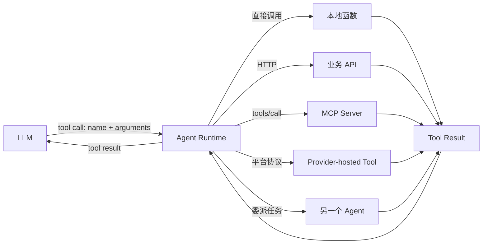

# Agent Tool 创建与形态调研

> [!abstract]
> Agent Tool 不只是“函数 + MCP”。函数、OpenAPI、MCP 主要描述工具如何声明、接入或被发现；本地执行、远程服务、厂商托管、沙箱、长工作流和另一个 Agent 则描述工具在哪里、以什么生命周期执行。最实用的理解是：**Tool 是面向模型的能力契约，函数、API、MCP Server 等是这个契约背后的执行端。**

相关背景见 [[ai-agent-framework-selection-research|AI Agent 开发框架技术选型调研（2026 全景）]]、[[Agent框架分层与选型QA总结|Agent 框架分层与选型 QA 总结]] 和 [[ReAct循环中的预期结果验证设计|ReAct 循环中的预期结果验证设计]]。

## 1. 先给结论：不是“函数或 MCP”二选一

“函数”和“MCP”不在同一个分类层级：

| 概念 | 回答的问题 | 本质 |
| --- | --- | --- |
| 普通函数 | 具体能力由什么代码实现？ | 进程内可执行代码 |
| Function Calling / Tool Calling | 模型如何表达“我要调用某能力”？ | 模型与 Agent Runtime 之间的调用契约 |
| OpenAPI | 一个 HTTP API 如何机器可读地描述？ | API 接口描述规范 |
| MCP | 客户端如何发现并调用外部 Tool？ | 标准化能力发现与调用协议 |
| Provider-hosted Tool | 谁负责真正执行工具？ | 模型厂商平台代为执行 |
| Agent-as-Tool | 被调用的能力是否拥有自己的推理循环？ | 组合与任务委派模式 |

因此，下面三种情况可以同时成立：

1. 一个本地 Python/Java 函数直接注册为 Tool；
2. 同一个函数放进 MCP Server 后，通过 MCP 暴露为 Tool；
3. Agent Runtime 从 MCP 发现它，再转换成模型能理解的 function/tool schema。



从模型视角看，这些执行端经常都被归一化为相似的 `name + description + input schema`。正因为模型看到的形状相似，才容易误以为所有 Tool 都是普通函数。

## 2. 一个 Tool 到底由什么组成

生产中的 Tool 不是“加一个注解的函数”这么简单，至少包含五部分：

| 部分 | 内容 | 解决的问题 |
| --- | --- | --- |
| 模型契约 | 名称、用途、输入 Schema、输出说明 | 模型何时调用、参数怎么填 |
| 执行引用 | 函数、HTTP API、MCP Tool、沙箱任务等 | 真正由谁执行 |
| 运行策略 | 超时、重试、并发、幂等、缓存 | 执行失败和重复调用怎么办 |
| 安全策略 | 身份、权限、审批、副作用级别、租户隔离 | 能不能执行、由谁授权 |
| 结果契约 | 结构化结果、错误语义、证据、产物引用 | Agent 如何理解和验证结果 |

可以抽象为：

```text
ToolDefinition {
  name
  description
  inputSchema
  outputSchema?
  executorRef
  sideEffectLevel
  authPolicy
  approvalPolicy
  timeoutAndRetryPolicy
  observabilityPolicy
}
```

OpenAI 的函数工具使用 JSON Schema 描述参数，标准流程是“应用暴露工具定义 -> 模型产生工具调用 -> 应用执行 -> 把结果交回模型”。官方文档也明确指出，模型不会替应用真正执行函数。[1]

MCP Tool 同样包含 `name`、描述和 `inputSchema`，还可以声明 `outputSchema`。不同之处是客户端通过 `tools/list` 动态发现，通过 `tools/call` 请求 MCP Server 执行，并可通过 `notifications/tools/list_changed` 感知工具列表变化。[2]

## 3. 创建 Tool 的六条路径

### 3.1 Code-first：从函数或方法生成

最常见的创建方式是在函数、Java 方法或可调用对象上增加注解和类型信息，由框架生成 Tool Schema。

```python
@tool
def get_order(order_id: str) -> dict:
    """查询订单当前状态。"""
    return order_service.get(order_id)
```

```java
@Tool(description = "查询订单当前状态")
OrderView getOrder(String orderId) {
    return orderService.get(orderId);
}
```

Spring AI 提供 `@Tool`、`MethodToolCallback`、`FunctionToolCallback` 和底层 `ToolCallback`；LangChain4j 既支持高层 `@Tool`，也支持低层 `ToolSpecification`。二者都说明：注解只是生成描述与接线的便捷方式，背后仍然需要 Schema、执行器和 Agent 循环。[3][5]

适合：

- 新能力就在 Agent 应用进程内；
- 工具数量不多，由同一团队维护；
- 需要最低调用延迟和最简单调试链路。

局限：

- 和语言、进程、发布周期绑定；
- 多个 Agent 客户端复用时容易重复写适配层；
- 动态发现、远程隔离和跨团队治理需要自行补齐。

### 3.2 Schema-first：手写 Tool Specification

先写模型可见的 JSON Schema，再把名称映射到执行器。这种方式不依赖函数反射，适合严格控制模型契约，或将同一契约映射到多个实现。

```json
{
  "name": "get_order",
  "description": "根据订单号查询订单当前状态。仅用于读取，不修改订单。",
  "parameters": {
    "type": "object",
    "properties": {
      "order_id": {
        "type": "string",
        "description": "订单号，例如 SO-20260724-001"
      }
    },
    "required": ["order_id"],
    "additionalProperties": false
  }
}
```

适合：

- 契约优先、跨语言或需要版本化；
- 自动生成的函数描述不够准确；
- 需要让无代码配置或注册中心管理 ToolDefinition。

需要注意：JSON Schema 只约束“参数长什么样”，不会自动解决权限、业务合法性、幂等和执行后验证。

### 3.3 API-first：从 HTTP API 或 OpenAPI 生成

已有业务系统通常不应为了 Agent 重写为本地函数。可以把 REST/RPC Client 包成 Tool，也可以从 OpenAPI 文档筛选并生成 Tool。

```text
OpenAPI operation
  -> 生成精简的 Tool name / description / input schema
  -> Agent Runtime 收到 tool call
  -> API Adapter 注入鉴权、租户和 tracing
  -> 调用业务 API
  -> 将 HTTP 响应映射成稳定的 ToolResult
```

Google ADK 将 OpenAPI Tool、MCP Tool、自定义函数、内置工具和第三方工具作为不同接入类别，说明 OpenAPI 并不是 MCP 的下级概念。[4]

不要把整份大型 OpenAPI 原样暴露给模型。应按场景挑选 operation，重新写面向任务的描述，并隐藏内部字段，否则会造成上下文膨胀、工具选择混乱和越权风险。

### 3.4 Protocol-first：由 MCP Server 暴露

当工具需要跨进程、跨语言、跨团队或被多个 Agent 客户端复用时，可以实现 MCP Server。客户端不需要预先写死每个 Tool，通过协议完成发现和调用。

概念上的发现请求：

```json
{
  "jsonrpc": "2.0",
  "id": 1,
  "method": "tools/list",
  "params": {}
}
```

概念上的调用请求：

```json
{
  "jsonrpc": "2.0",
  "id": 2,
  "method": "tools/call",
  "params": {
    "name": "get_order",
    "arguments": {
      "order_id": "SO-20260724-001"
    }
  }
}
```

MCP 适合：

- 同一组能力要提供给 Claude、Codex、IDE、内部 Agent 等多个客户端；
- Tool 需要独立部署、动态上下线或由另一个团队维护；
- 需要统一资源发现、协议错误、能力元数据和调用边界；
- 希望避免为每个 Agent 框架分别开发专用插件。

MCP 不会自动带来：

- 正确的业务权限模型；
- 安全的网络边界；
- 幂等、事务和补偿；
- 高质量工具描述；
- 对 Tool Result 的事实验证。

MCP 规范要求服务端校验输入、执行访问控制、限流并清理输出；客户端应考虑敏感操作确认、调用结果展示、超时和审计。[2] 所以“接了 MCP”不等于“生产治理完成”。

### 3.5 Platform-first：使用模型厂商托管工具

有些 Tool 由模型厂商在服务端执行，例如托管的网页搜索、代码执行或数据检索。Anthropic 明确区分 client tools 和 Anthropic server tools：前者由应用执行并返回结果，后者由 Anthropic 的基础设施执行。[6]

这类工具的优点是接入快、执行循环短；代价是供应商绑定、数据边界和可观测性受平台能力约束。它们证明了 Tool 并不一定对应应用中的一个函数，也不一定经过 MCP。

### 3.6 Composition-first：将工作流或 Agent 包装为 Tool

Tool 的执行端还可以是一个确定性工作流、长任务，甚至另一个带独立模型和上下文的 Agent。Google ADK 明确列出 Agent-as-a-Tool 和 Long-running Function Tool；LangChain4j 也支持将 AI Service 作为 Tool。[4][5]

适合将 Agent 包成 Tool 的情况：

- 子任务边界明确，例如“完成一份带来源的行业调研”；
- 子任务需要独立上下文、工具集或模型；
- 主 Agent 只需要结构化结果，不需要观察每个内部步骤。

如果只是一次确定性查询，不要为了“多 Agent”再套一个 Agent。普通函数或 API Tool 更稳定、便宜，也更容易验证。

## 4. Tool 有哪些运行形态

下面按“执行端和生命周期”分类。这比简单分成函数与 MCP 更能指导架构选型。

| 形态 | 执行位置 | 典型能力 | 关键风险 |
| --- | --- | --- | --- |
| 进程内函数 Tool | Agent 应用进程 | 计算、格式转换、调用内部 Service | 和应用耦合、阻塞、权限过大 |
| 远程 API Tool | 独立业务服务 | 订单、CRM、支付、搜索 | 鉴权、网络失败、接口语义泄漏 |
| MCP Tool | MCP Server 背后 | 跨客户端共享的文件、数据、SaaS 能力 | 服务信任、提示注入、动态变更 |
| Provider-hosted Tool | 模型厂商平台 | Web search、code execution、retrieval | 供应商绑定、数据和审计边界 |
| Sandbox / Computer Tool | 容器、浏览器或虚拟桌面 | Shell、代码、网页和 GUI 操作 | 高副作用、环境逃逸、不可重复 |
| Retrieval / Data Tool | 搜索引擎、向量库、数据库 | 结构化查询、语义检索、取证 | 越权读取、错误引用、上下文污染 |
| Workflow / Long-running Tool | 工作流引擎、任务系统 | 审批、批处理、耗时作业 | 暂停恢复、重复提交、状态一致性 |
| Agent-as-Tool | 独立 Agent Runtime | 研究、规划、领域任务 | 递归失控、成本、责任边界模糊 |

还有两种常见的“工具管理机制”，它们不是新的执行形态：

- **Toolset / namespace**：把工具按业务域、权限或场景分组；
- **Dynamic tools / tool search**：开始时不把所有定义塞进上下文，而是在需要时搜索并加载。

OpenAI 的函数调用文档提供命名空间、工具搜索和延迟加载相关能力；Google ADK 的 Toolset 也支持对一组工具进行动态管理。[1][4]

## 5. 函数、OpenAPI、MCP 怎么选

| 判断条件 | 本地函数 | API / OpenAPI Adapter | MCP |
| --- | --- | --- | --- |
| 只给一个 Agent 应用使用 | 首选 | 可用 | 通常过重 |
| 能力已有稳定业务 API | 包一层 Client 可用 | 首选 | 视复用需求决定 |
| 多语言、多 Agent 客户端复用 | 适配成本高 | 每个客户端仍需接入 | 首选 |
| 需要动态发现和工具列表变更 | 自行实现 | 自行实现 | 原生支持 |
| 需要独立部署和团队边界 | 弱 | 强 | 强 |
| 最低延迟 | 最好 | 有网络开销 | 有协议和网络开销 |
| 最低运维复杂度 | 最好 | 中等 | 较高 |
| 标准化生态接入 | 弱 | OpenAPI 生态强 | Agent 工具生态强 |

建议采用渐进路线：

```text
单应用、少量工具
  -> 本地函数 / ToolCallback

已有业务系统
  -> API Adapter，必要时从 OpenAPI 生成候选契约

同一能力被多个 Agent 客户端复用
  -> MCP Server

能力需要独立推理和上下文
  -> Agent-as-Tool

能力由模型平台原生提供且边界可接受
  -> Provider-hosted Tool
```

不要为了使用 MCP 而使用 MCP。对只在一个 Java 服务内使用的三个简单工具，Spring AI 的 `@Tool`/`ToolCallback` 通常已经足够。反过来，如果十个 Agent 客户端都要接同一套企业能力，继续复制本地函数适配层会形成更高的长期成本，此时 MCP 才真正有价值。

## 6. 创建一个生产 Tool 的设计步骤

### 6.1 先定义任务能力，不要直接暴露底层接口

一个 Tool 应对应模型能理解的完整动作，而不是数据库表或通用 HTTP 客户端。

| 不推荐 | 推荐 | 原因 |
| --- | --- | --- |
| `execute_sql(sql)` | `get_customer_orders(customer_id, date_range)` | 降低注入和越权风险 |
| `http_request(url, body)` | `create_refund(order_id, amount, reason)` | 明确业务语义和副作用 |
| `update_order(fields)` | `cancel_order(order_id, reason, idempotency_key)` | 让非法状态更难表达 |

### 6.2 写清模型契约

Tool 描述至少回答：

1. 什么时候应该调用；
2. 什么时候不应该调用；
3. 每个参数的业务含义、格式、单位和约束；
4. 是否会产生外部副作用；
5. 返回什么，以及“已受理”和“已完成”有何区别。

严格 Schema 应尽量通过枚举、必填字段和 `additionalProperties: false` 排除无效状态。OpenAI 官方同样建议使用明确的名称和参数描述、启用 strict mode，并控制初始可见工具数量。[1]

### 6.3 设计结果和错误契约

建议统一返回结构化结果，不要把成功、业务失败和系统异常都塞进一段字符串。

```json
{
  "status": "SUCCEEDED",
  "data": {
    "order_id": "SO-20260724-001",
    "order_status": "SHIPPED"
  },
  "evidence": {
    "source": "order-service",
    "observed_at": "2026-07-24T10:30:00+08:00"
  },
  "retryable": false
}
```

至少区分：

- 参数或契约错误：模型可以修正参数后重试；
- 业务拒绝：换参数也未必能成功，例如订单状态不允许取消；
- 权限或审批不足：应暂停并升级，不能让模型绕过；
- 临时系统错误：可根据幂等性和预算重试；
- 结果未知：调用已超时，但服务端可能已经执行，禁止盲目重复提交。

MCP 还区分协议错误和 Tool 自身的执行错误，客户端应据此决定是修正调用、重试还是停止。[2]

### 6.4 显式声明副作用和幂等性

可以按风险把 Tool 分级：

| 级别 | 示例 | 默认策略 |
| --- | --- | --- |
| `READ_ONLY` | 查询订单、搜索文档 | 可自动调用，仍需数据权限 |
| `REVERSIBLE_WRITE` | 创建草稿、加标签 | 可在预授权范围内调用并记录审计 |
| `IRREVERSIBLE_WRITE` | 付款、发邮件、删除资源 | 调用前审批或严格策略门禁 |
| `PRIVILEGED` | 修改权限、执行任意 Shell | 沙箱隔离、最小权限和强审批 |

写操作应接受 `idempotency_key` 或业务唯一键。Agent 循环、网络超时和工作流恢复都可能造成同一调用被重复执行。

### 6.5 把上下文注入和模型参数分开

租户 ID、用户身份、访问令牌、trace ID 和审批凭证不应由模型自由填写。它们应由 Runtime 根据当前会话或任务上下文注入。Google ADK 的 `ToolContext` 就用于向工具提供状态、认证、产物、记忆和流程控制，而不必全部暴露为模型参数。[4]

### 6.6 为动态和远程工具增加信任边界

MCP Server 返回的工具描述和 Tool Result 都应被视为外部输入：

- 对 Server 做 allowlist、身份认证和版本固定；
- 对每个 Tool 再做本地权限过滤，不把 Server 的全部能力直接交给模型；
- 限制输出大小和内容类型，隔离潜在提示注入；
- 记录 Tool 列表版本、调用者、参数摘要、结果状态和延迟；
- 工具列表变化时重新做策略评估，而不是自动信任新增工具。

## 7. Tool 调用不等于任务完成

Tool 的返回只是一条 Observation。即使调用状态是 `SUCCEEDED`，也不能直接证明 Agent 的目标已经完成。

```text
Tool call 成功
  -> 只表示执行端接受并完成了这个动作

Tool result 满足 postcondition
  -> 表示这个动作达到了预期效果

所有 required criteria 通过
  -> 才表示整个 Agent 目标完成
```

例如 `send_email` 返回成功，只能证明邮件服务已受理；如果目标是“让客户收到正确的报价”，仍要验证收件人、附件版本、发送状态和报价内容。具体的 `PASS / FAIL / UNKNOWN`、证据和定向重试机制见 [[ReAct循环中的预期结果验证设计|ReAct 循环中的预期结果验证设计]]。

因此，Tool 最好同时提供：

- 可机器判断的结构化状态；
- 业务对象 ID 或产物引用；
- 权威状态查询入口；
- 产生结果的时间和来源；
- 是否可重试以及重试注意事项。

## 8. 框架中的对应关系

| 框架 / 协议 | 主要创建入口 | 执行控制 |
| --- | --- | --- |
| OpenAI API | JSON Schema function tools、custom tools、平台工具 | 应用执行 function tool；部分平台工具由服务端执行 |
| MCP | Server 声明 `tools/list`，实现 `tools/call` | MCP Server 执行，Client 负责暴露、确认和结果回灌 |
| Anthropic | client tools、Anthropic server tools、MCP connector | 应用执行 client tool；Anthropic 执行 server tool |
| Spring AI | `@Tool`、`MethodToolCallback`、`FunctionToolCallback`、`ToolCallback` | 可由框架、Advisor 或用户代码控制执行 |
| Google ADK | Function、OpenAPI、MCP、built-in、long-running、Agent-as-Tool | Tool、Toolset 和 Runner 共同管理 |
| LangChain4j | `@Tool`、`ToolSpecification`、AI Service as Tool | AI Services 可自动完成模型—工具循环 |

这张表说明，成熟框架通常不只支持一种 Tool 形态。框架解决的是适配和循环，具体采用本地函数、API 还是 MCP，仍应由复用边界、部署边界、安全边界和生命周期决定。

## 9. 推荐的最小生产接口

如果自己设计 Tool 抽象，建议至少覆盖下面这些字段：

```text
ToolDefinition
  identity: name, version, namespace
  modelContract: description, inputSchema, outputSchema
  execution: executorRef, timeout, concurrencyLimit
  safety: sideEffectLevel, requiredScopes, approvalPolicy
  reliability: idempotencyPolicy, retryPolicy
  lifecycle: availability, deprecation, dynamicSource

ToolCallContext
  taskId, callId, actor, tenant, traceId
  authContext, approvalRef, deadline

ToolResult
  status: SUCCEEDED | REJECTED | FAILED | UNKNOWN
  data, errorCode, evidenceRefs
  retryable, observedAt
```

其中 `executorRef` 可以指向函数、Bean、HTTP operation、MCP server/tool、工作流或子 Agent。这样上层 Agent Loop 不需要关心底层是哪种实现，只处理统一的 ToolCall 和 ToolResult。

## 10. 补充问答：已有函数如何作为 Tool 接入

### 10.1 核心做法

已有函数接入 Tool，不是让模型直接访问函数，而是在它外面增加一个 `Tool Adapter`：

```text
已有业务函数
  -> Tool Adapter
       - Tool 名称和使用说明
       - 模型可填写的输入 Schema
       - 身份、租户和鉴权上下文注入
       - 结果与错误转换
  -> Tool Registry
  -> Agent Runtime
```

Tool Adapter 的价值是隔离模型契约和业务实现。已有函数可以继续使用原来的参数、异常和领域对象，Adapter 只向模型暴露完成任务所需的最小接口。

### 10.2 Java / Spring AI 示例

假设已有业务方法需要订单号和可信用户上下文：

```java
class OrderService {

    Order getOrder(String orderId, UserContext context) {
        // 已有业务逻辑
    }
}
```

不要把 `UserContext` 作为模型参数。增加 Tool Adapter，由 Runtime 侧注入上下文：

```java
class OrderTools {

    private final OrderService orderService;
    private final UserContextProvider contextProvider;

    OrderTools(
        OrderService orderService,
        UserContextProvider contextProvider
    ) {
        this.orderService = orderService;
        this.contextProvider = contextProvider;
    }

    @Tool(description = """
        根据订单号查询订单当前状态。
        只用于读取订单，不会修改订单。
        """)
    OrderToolResult getOrder(
        @ToolParam(description = "订单号，例如 SO-20260724-001")
        String orderId
    ) {
        UserContext context = contextProvider.current();
        Order order = orderService.getOrder(orderId, context);

        return new OrderToolResult(
            "SUCCEEDED",
            order.getId(),
            order.getStatus()
        );
    }
}
```

然后将 Adapter 注册给当前模型请求或 Agent：

```java
OrderTools orderTools = new OrderTools(
    orderService,
    contextProvider
);

String result = chatClient
    .prompt()
    .user("查询订单 SO-20260724-001 的状态")
    .tools(orderTools)
    .call()
    .content();
```

不同 Spring AI 版本的 Builder API 可能不同，但底层关系不变：`OrderTools` 被转换成一个或多个 `ToolCallback`，并在模型产生调用请求时执行。

### 10.3 Python 示例

Python 框架通常通过装饰器完成相同的注册过程：

```python
def existing_get_order(order_id: str, user_context) -> dict:
    # 已有业务函数
    ...


@function_tool
def get_order(order_id: str) -> dict:
    """根据订单号查询订单状态，只读，不修改订单。"""
    user_context = get_current_user_context()

    try:
        order = existing_get_order(order_id, user_context)
        return {
            "status": "SUCCEEDED",
            "data": {
                "order_id": order["id"],
                "order_status": order["status"],
            },
            "retryable": False,
        }
    except OrderNotFound:
        return {
            "status": "REJECTED",
            "error_code": "ORDER_NOT_FOUND",
            "retryable": False,
        }
```

这里的 `function_tool` 代表框架提供的 Tool 装饰器，具体名称会因 OpenAI Agents SDK、Pydantic AI、LangChain 等框架而变化。

### 10.4 接入时的五项检查

1. 函数是否代表一个明确业务动作，而不是 `execute_sql`、`http_request` 这类过宽入口；
2. 是否只暴露模型真正需要填写的字段；
3. 名称和描述是否说明什么时候使用、什么时候不能使用；
4. 是否区分成功、业务拒绝、系统失败和结果未知；
5. 写操作是否具备权限校验、幂等键、审批和审计。

单应用内部优先使用本地函数 Tool。同一能力需要提供给多个 Agent、IDE 或不同语言客户端时，再考虑在 Adapter 之外增加 MCP Server。

## 11. 补充问答：注解如何让大模型使用函数

### 11.1 注解不会直接连接模型

`@Tool` 和 `@ToolParam` 本身只是运行时元数据。真正完成连接的是框架中的五个机制：

```text
注解和类型信息
  -> 反射扫描
  -> 生成 Tool JSON Schema
  -> Schema 随请求发送给模型
  -> Runtime 接收 tool call 并执行真实方法
```

模型看不到 Java 方法体、Spring Bean 或数据库代码。它只看到 Tool 的名称、描述、输入 Schema，以及必要时的输出说明。

### 11.2 运行时反射读取注解

Java Tool 注解通常保留到运行时：

```java
@Retention(RetentionPolicy.RUNTIME)
@Target(ElementType.METHOD)
public @interface Tool {
    String name() default "";
    String description();
}
```

框架在注册 Tool 时扫描对象的方法：

```java
for (Method method : toolObject.getClass().getDeclaredMethods()) {
    Tool annotation = method.getAnnotation(Tool.class);

    if (annotation != null) {
        registerTool(toolObject, method, annotation);
    }
}
```

注册表保存的不是只有名称，而是名称到执行回调、目标对象、参数类型和 Schema 的映射：

```text
get_order
  -> target: OrderTools Bean
  -> method: OrderTools#getOrder
  -> input: orderId:string
  -> callback: MethodToolCallback
```

### 11.3 Java 类型被转换成 JSON Schema

框架结合方法签名、泛型、Record/POJO 字段和参数注解生成模型契约。常见映射如下：

| Java 类型 | JSON Schema |
| --- | --- |
| `String` | `string` |
| `Integer`、`Long` | `integer` |
| `Double`、`BigDecimal` | `number` |
| `Boolean` | `boolean` |
| `List<T>` | `array` |
| `enum` | 带 `enum` 约束的 `string` |
| Record、POJO | `object + properties` |

前面的 `getOrder` 方法可以被转换为：

```json
{
  "type": "function",
  "function": {
    "name": "get_order",
    "description": "根据订单号查询订单当前状态，只读，不修改订单。",
    "parameters": {
      "type": "object",
      "properties": {
        "orderId": {
          "type": "string",
          "description": "订单号，例如 SO-20260724-001"
        }
      },
      "required": ["orderId"],
      "additionalProperties": false
    }
  }
}
```

自动生成 Schema 并不意味着契约一定足够好。方法名模糊、参数名缺失、描述过短或 POJO 过于复杂，都会降低模型选择和填写 Tool 的准确率。

### 11.4 Tool Schema 随模型请求发送

框架会把 ToolDefinition 放进模型请求：

```json
{
  "messages": [
    {
      "role": "user",
      "content": "查询订单 SO-20260724-001 的状态"
    }
  ],
  "tools": [
    {
      "type": "function",
      "function": {
        "name": "get_order",
        "description": "根据订单号查询订单当前状态，只读，不修改订单。",
        "parameters": {
          "type": "object",
          "properties": {
            "orderId": {
              "type": "string"
            }
          },
          "required": ["orderId"],
          "additionalProperties": false
        }
      }
    }
  ]
}
```

这一步才是“大模型能够使用到函数”的直接原因：支持 Tool Calling 的模型根据当前消息和 Tool Schema，判断是否需要调用以及如何构造参数。[1]

### 11.5 模型只返回调用意图

模型不会进入 JVM 执行方法，而是返回结构化调用请求：

```json
{
  "tool_calls": [
    {
      "id": "call_001",
      "type": "function",
      "function": {
        "name": "get_order",
        "arguments": "{\"orderId\":\"SO-20260724-001\"}"
      }
    }
  ]
}
```

它表达的是：“请应用调用 `get_order`，参数为这个 JSON”。真实执行仍由 Agent Runtime 负责。

### 11.6 Runtime 校验、分派并反射执行

Runtime 根据 Tool 名称查找回调，然后依次执行：

```text
解析 arguments JSON
  -> 按 JSON Schema 校验
  -> 转换为 Java 参数或 DTO
  -> 注入用户、租户、Token、traceId 等可信上下文
  -> 检查权限和审批
  -> 调用 MethodToolCallback
  -> 反射执行目标方法
  -> 捕获异常并序列化 ToolResult
```

核心分派逻辑可以简化为：

```java
ToolCallback callback = toolRegistry.get(toolCall.name());

Object arguments = objectMapper.readValue(
    toolCall.arguments(),
    callback.inputType()
);

Object result = callback.call(arguments, runtimeContext);
```

直接使用 Java 反射时，最终执行类似：

```java
Object result = method.invoke(targetObject, convertedArguments);
```

### 11.7 执行结果再次交给模型

Runtime 将函数返回值转换成与 `call_001` 对应的 Tool Message：

```json
{
  "role": "tool",
  "tool_call_id": "call_001",
  "content": {
    "status": "SUCCEEDED",
    "order_id": "SO-20260724-001",
    "order_status": "SHIPPED"
  }
}
```

然后第二次请求模型，让模型结合 Tool Result 生成最终回答。因此一次外部 `.call()` 内部可能包含：

```text
第一次模型调用
  -> 模型返回 tool_call

Runtime 执行 Java 方法
  -> 产生 ToolResult

第二次模型调用
  -> 模型根据 ToolResult 生成最终答案
```

Spring AI、LangChain4j 等框架可以自动完成这个循环，也允许应用接管执行和循环控制。[3][5]

### 11.8 本地注解 Tool 与 MCP Tool 的区别

两者对模型暴露的契约很相似，差别主要在发现和执行路径：

```text
本地注解 Tool
  模型 -> Agent Runtime -> Tool Registry -> Java 反射调用

MCP Tool
  Agent Runtime -> tools/list -> 转换为模型 Tool Schema
  模型 -> Agent Runtime -> tools/call -> MCP Server 执行
```

所以，注解负责声明，反射负责发现和本地执行，JSON Schema 负责让模型理解，Agent Runtime 负责连接模型调用与真实函数。MCP 则把发现和执行端扩展到进程外的标准协议边界。

## 12. 最终判断

“Agent 的 Tool 是不是函数 + MCP？”可以分两层回答：

> [!success] 简短回答
> **不是。** 本地函数和 MCP 是最常见的两种接入方式，但完整形态还包括远程 API/OpenAPI、模型厂商托管工具、沙箱/浏览器/计算机操作、检索与数据工具、长工作流和 Agent-as-Tool。

> [!important] 更准确的回答
> Function Calling 是模型提出结构化调用请求的方式；普通函数是能力的一种本地实现；MCP 是发现和调用外部能力的标准协议。MCP Tool 最终常被 Agent Runtime 转成与 function tool 相似的模型契约，但它在部署、发现、生命周期和信任边界上与本地函数不同。

默认选型原则：

1. 单应用内的简单能力，先用本地函数 Tool；
2. 已有业务服务，用窄化后的 API Adapter，不直接暴露通用接口；
3. 多客户端复用、跨语言和独立部署，再引入 MCP；
4. 需要独立推理上下文时才使用 Agent-as-Tool；
5. 无论哪种形态，都必须补齐权限、幂等、错误语义、审计和结果验证。

## 参考资料

1. OpenAI, [Function calling](https://developers.openai.com/api/docs/guides/function-calling), 访问于 2026-07-24。
2. Model Context Protocol, [Tools - MCP Specification 2025-11-25](https://modelcontextprotocol.io/specification/2025-11-25/server/tools), 访问于 2026-07-24。
3. Spring AI, [Tool Calling](https://docs.spring.io/spring-ai/reference/api/tools.html), 访问于 2026-07-24。
4. Google Agent Development Kit, [Custom tools for ADK](https://adk.dev/tools-custom/), 访问于 2026-07-24。
5. LangChain4j, [Tools (Function Calling)](https://docs.langchain4j.dev/tutorials/tools/), 访问于 2026-07-24。
6. Anthropic, [Tool use with Claude](https://platform.claude.com/docs/en/agents-and-tools/tool-use/overview), 访问于 2026-07-24。
