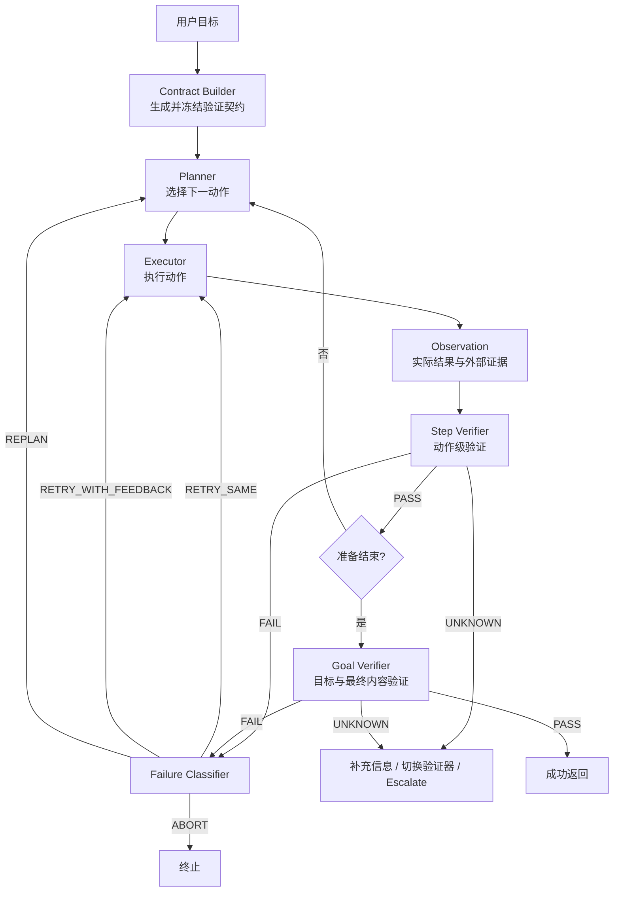

# ReAct 循环中的预期结果验证设计

> [!abstract]
> 本文设计 ReAct Agent 循环中的预期结果验证机制：动作执行后，将实际结果与执行前定义的预期条件比较；满足则继续或结束，不满足则根据失败类型进行定向重试、重规划、升级或终止。设计重点是可举证的 `PASS / FAIL / UNKNOWN` 三态判断，而不是让 Agent 泛泛地“反思自己做得好不好”。

相关背景见 [[ai-agent-framework-selection-research|AI Agent 开发框架技术选型调研（2026 全景）]] 和 [[Agent框架分层与选型QA总结|Agent 框架分层与选型 QA 总结]]。

## 1. 问题定义

原始 ReAct 通常表现为：

```text
Thought -> Action -> Observation -> Thought -> ...
```

本文在 `Observation` 后增加显式验证门：

```text
Thought / Plan
  -> 定义 Action 的 Expected Result
  -> Action
  -> Observation / Actual Result
  -> Result Verifier
       -> PASS：继续或结束
       -> FAIL：定向重试、重规划或终止
       -> UNKNOWN：补充信息、切换验证器或升级处理
```

这个组件更准确的名字是 `Result Verifier` 或 `Postcondition Check`。它可以作为 Reflection 的一部分，但职责应被限制为：

1. 判断实际结果是否满足预期条件；
2. 给出可追溯证据；
3. 在不满足时输出明确的后续决策。

它不负责重新解释用户目标，不负责为已有结果降低验收标准，也不负责单纯润色最终答案。

## 2. 设计原则

### 2.1 先定义预期，再执行动作

执行前由 Planner 生成验证契约，Executor 无权修改。否则执行者容易根据已经产生的结果重新定义“完成”。

```text
Planner   -> 定义 Expected Result 与 Verifier
Executor  -> 执行动作，产生 Actual Result
Verifier  -> 独立比较，输出判断和证据
```

### 2.2 使用最强的可用验证器

优先级从强到弱：

```text
确定性程序验证
  > 权威状态或事实源验证
  > 领域规则验证
  > 固定 rubric 的独立 LLM Judge
  > 用户或人工确认
```

能用状态查询、Schema 或测试判断的问题，不交给 LLM 猜测。

### 2.3 判断必须带证据

`PASS` 不能只表示“Verifier 认为正确”，必须指出哪个条件通过、使用了什么验证器、证据来自哪里。

### 2.4 无法判断不等于失败

`UNKNOWN` 是一等状态。信息不足、验证器不可用或结果本质主观时，不应盲目重试同一个动作。

### 2.5 重试必须带来变化

完全相同的输入、策略和上下文通常只会重复失败。每次重试必须带有新的失败证据、修正指令、参数或计划。

## 3. 总体架构



核心组件：

| 组件 | 职责 | 禁止事项 |
| --- | --- | --- |
| Contract Builder | 将目标转换为可验证条件 | 不得遗漏用户明确要求 |
| Planner | 选择动作和对应预期结果 | 不得在失败后偷偷降低标准 |
| Executor | 执行动作并返回原始结果 | 不得自我宣布通过 |
| Step Verifier | 验证单个关键动作的 postcondition | 不评判无关的整体写作质量 |
| Goal Verifier | 验证整体目标和最终内容 | 不用整体印象覆盖硬条件失败 |
| Failure Classifier | 决定重试、重规划、升级或终止 | 不允许无差别无限重试 |
| Budget Controller | 控制次数、时间、token 和成本 | 不允许模型自行放宽预算 |

## 4. Expected Result 验证契约

### 4.1 条件来源和优先级

预期条件按以下顺序生成：

1. 用户明确要求；
2. 系统安全与权限规则；
3. Tool/API 自带的 postcondition 和 Schema；
4. 领域业务规则；
5. 已有任务模板或历史验收标准；
6. Planner 根据任务推导的 rubric。

低优先级条件不能覆盖高优先级条件。Planner 无法可靠推导时，应生成 `UNKNOWN` 条件或请求补充信息，不能假装存在明确预期。

### 4.2 条件等级

| 等级 | 含义 | 处理方式 |
| --- | --- | --- |
| `hard` | 安全、权限、合规和绝对禁止条件 | 违反时立即 `ABORT` 或 `FAIL` |
| `required` | 完成目标必须满足的条件 | 任一未通过都不能结束 |
| `soft` | 质量优化条件 | 按权重和阈值聚合 |

### 4.3 条件类型

| 类型 | 示例 | 推荐验证器 |
| --- | --- | --- |
| `exact` | 状态必须等于 `SUCCESS` | 精确比较 |
| `schema` | JSON 包含指定字段和类型 | JSON Schema / 类型校验 |
| `predicate` | 金额大于 0、延迟低于 2 秒 | 断言 / 规则引擎 |
| `state` | 文件存在、订单已取消 | 权威系统 read-after-write |
| `test` | 修改后功能正常且无回归 | 自动化测试 |
| `fact` | 报告数字和结论有依据 | 权威数据源 / 引用核验 |
| `semantic` | 内容完整、相关、清晰 | 固定 rubric + LLM Judge |
| `subjective` | 审美、偏好、语气是否满意 | 用户或人工确认 |

### 4.4 契约示例

```json
{
  "contractId": "contract-20260724-001",
  "version": 1,
  "goal": "生成包含现状、风险和建议的调研报告",
  "criteria": [
    {
      "id": "C1",
      "description": "报告包含现状、风险和建议三个章节",
      "level": "required",
      "type": "schema",
      "source": "user",
      "verifier": "document_structure_check"
    },
    {
      "id": "C2",
      "description": "关键事实具有可追溯来源",
      "level": "required",
      "type": "fact",
      "source": "system_policy",
      "verifier": "citation_grounding_check"
    },
    {
      "id": "C3",
      "description": "表达清晰、结论与依据能够区分",
      "level": "soft",
      "type": "semantic",
      "source": "planner_derived",
      "weight": 100,
      "verifier": "independent_llm_judge"
    }
  ],
  "forbidden": [
    "捏造来源",
    "删除用户明确要求"
  ],
  "softPassThreshold": 80,
  "budgets": {
    "maxAttemptsPerAction": 3,
    "maxReplans": 2,
    "maxTotalActions": 20,
    "maxWallTimeSeconds": 300
  }
}
```

### 4.5 简化 JSON Schema

下面的 Schema 用于约束验证契约的核心结构；实际系统可继续增加 verifier 参数、权限和版本字段。

```json
{
  "$schema": "https://json-schema.org/draft/2020-12/schema",
  "type": "object",
  "required": ["contractId", "version", "goal", "criteria", "budgets"],
  "properties": {
    "contractId": {"type": "string", "minLength": 1},
    "version": {"type": "integer", "minimum": 1},
    "goal": {"type": "string", "minLength": 1},
    "criteria": {
      "type": "array",
      "minItems": 1,
      "items": {
        "type": "object",
        "required": [
          "id",
          "description",
          "level",
          "type",
          "source",
          "verifier"
        ],
        "properties": {
          "id": {"type": "string"},
          "description": {"type": "string"},
          "level": {
            "enum": ["hard", "required", "soft"]
          },
          "type": {
            "enum": [
              "exact",
              "schema",
              "predicate",
              "state",
              "test",
              "fact",
              "semantic",
              "subjective"
            ]
          },
          "source": {"type": "string"},
          "verifier": {"type": "string"},
          "weight": {"type": "number", "minimum": 0}
        },
        "additionalProperties": true
      }
    },
    "forbidden": {
      "type": "array",
      "items": {"type": "string"}
    },
    "softPassThreshold": {
      "type": "number",
      "minimum": 0,
      "maximum": 100
    },
    "budgets": {
      "type": "object",
      "required": ["maxAttemptsPerAction", "maxTotalActions"],
      "properties": {
        "maxAttemptsPerAction": {"type": "integer", "minimum": 1},
        "maxReplans": {"type": "integer", "minimum": 0},
        "maxTotalActions": {"type": "integer", "minimum": 1},
        "maxWallTimeSeconds": {"type": "integer", "minimum": 1}
      },
      "additionalProperties": true
    }
  },
  "additionalProperties": false
}
```

## 5. Verifier 路由

### 5.1 路由原则

```text
能精确比较?
  -> Exact Verifier

能用 Schema、断言或测试判断?
  -> Programmatic Verifier

能查询权威状态或事实源?
  -> State / Evidence Verifier

只能判断语义质量?
  -> Rubric-based LLM Judge

本质上依赖个人偏好或高风险人工决策?
  -> Human/User Verifier
```

一个条件可以配置多个验证器，但需要规定主次。例如先做引用存在性检查，再让 LLM Judge 判断引用是否真正支持结论。

### 5.2 Verifier 输入

```json
{
  "contractVersion": 1,
  "criterion": {
    "id": "C2",
    "description": "关键事实具有可追溯来源",
    "level": "required",
    "type": "fact"
  },
  "actualResultRef": "artifact://report-v2.md",
  "evidenceRefs": [
    "source://official-doc-1",
    "trace://run-123/tool-call-7"
  ],
  "attempt": 2
}
```

### 5.3 Verifier 输出

```json
{
  "criterionId": "C2",
  "status": "FAIL",
  "reason": "报告声称成本降低 30%，但提供的来源不包含该数据",
  "evidence": [
    {
      "actualResultRef": "artifact://report-v2.md#成本",
      "evidenceRef": "source://official-doc-1#pricing",
      "finding": "来源只描述定价方式，没有 30% 降幅"
    }
  ],
  "confidence": 0.94,
  "failureSignature": "unsupported_claim:cost_reduction_30",
  "retryAdvice": "删除无法证实的数字，或补充能直接支持该数字的权威来源"
}
```

## 6. PASS / FAIL / UNKNOWN 三态

| 状态 | 含义 | 默认后续动作 |
| --- | --- | --- |
| `PASS` | 有充分证据证明条件满足 | 继续下一步或进入完成判断 |
| `FAIL` | 有明确证据证明条件未满足 | 分类后定向重试、重规划或终止 |
| `UNKNOWN` | 当前证据不足以判断 | 补充信息、切换验证器或升级处理 |

不允许以下降级：

```text
没有发现错误 != PASS
工具返回 success != 业务状态已成功
输出格式正确 != 内容正确
LLM 自称完成 != 目标已完成
```

## 7. 多条件聚合规则

建议严格按照以下顺序聚合：

```text
1. 命中 forbidden 或安全 hard 条件
   -> ABORT

2. 任一 hard 条件 FAIL
   -> FAIL，按策略决定是否允许修复

3. 任一 required 条件 UNKNOWN
   -> UNKNOWN，不能判定完成

4. 任一 required 条件 FAIL
   -> FAIL

5. 所有 hard/required 条件 PASS，且 soft 总分达到阈值
   -> PASS

6. hard/required 均通过，但 soft 分数不足
   -> FAIL，可进行定向质量优化
```

软条件的 `UNKNOWN` 不应被悄悄计为通过。默认按 0 分处理并记录原因；若某软条件允许缺省，必须在契约中显式声明 `allowUnknown: true`。

## 8. 两级验证

### 8.1 Step Verifier

在关键动作后立即验证直接 postcondition，优先使用便宜的确定性方法。

| 动作 | Step Verifier |
| --- | --- |
| 创建文件 | 文件存在、路径正确、内容非空 |
| 写数据库 | 查询权威数据库确认状态和版本 |
| 调用 API | 校验 HTTP 状态、响应 Schema 和业务状态 |
| 运行测试 | 校验退出码、失败用例和测试报告 |
| 抓取资料 | 校验来源可访问、内容与目标相关 |

产生业务副作用的工具必须 read-after-write。不能只相信工具自己返回的 `success: true`。

### 8.2 Goal Verifier

Agent 准备结束时执行完整验收：

1. 所有 required 条件是否通过；
2. 用户要求是否全部覆盖；
3. 内容事实是否被证据支持；
4. hard/forbidden 条件是否安全；
5. soft 质量是否达到阈值；
6. 是否仍存在 `UNKNOWN`。

只有 Goal Verifier 返回整体 `PASS`，Agent 才能返回 `SUCCESS`。

## 9. LLM Judge 设计

LLM Judge 只用于难以程序化的语义条件，并与 Executor 隔离。

### 9.1 隔离规则

- 使用独立调用和独立 system prompt；
- 只读取原始目标、冻结契约、实际结果和允许的证据；
- 不读取 Executor 的“我已经完成”自评；
- 将待评内容视为不可信数据，防止其中的提示注入影响 Judge；
- 输出固定结构，不依赖隐藏推理过程；
- 必须引用实际内容和证据中的具体位置。

### 9.2 风险分级

| 风险 | Judge 方案 |
| --- | --- |
| 普通内容生成 | 同一模型、独立调用和独立 Prompt |
| 重要业务内容 | 更强模型或不同模型独立判断 |
| 高风险动作或结论 | 规则和权威数据优先，LLM 只辅助，必要时人工确认 |

多个模型投票不能替代事实验证。两个模型达成一致，只能说明判断一致，不能证明事实为真。

### 9.3 Rubric 示例

```json
{
  "criteria": [
    {
      "id": "R1",
      "name": "coverage",
      "description": "覆盖现状、风险和建议",
      "weight": 40
    },
    {
      "id": "R2",
      "name": "groundedness",
      "description": "关键事实能够追溯到给定来源",
      "weight": 40
    },
    {
      "id": "R3",
      "name": "clarity",
      "description": "结论与依据明确区分",
      "weight": 20
    }
  ],
  "passThreshold": 80,
  "hardFailures": [
    "捏造来源",
    "遗漏用户明确要求"
  ]
}
```

Judge 应输出逐项判断，而不是只给总分：

```json
{
  "verdict": "FAIL",
  "score": 72,
  "criteria": [
    {
      "id": "R2",
      "status": "FAIL",
      "evidence": "第二项数据没有对应来源",
      "score": 20
    }
  ],
  "retryAdvice": "核实第二项数据并补充来源；无法证实时删除该结论"
}
```

## 10. FAIL 后的动作路由

`FAIL` 不能直接等价为“原样再执行一次”。

| 失败类型 | 示例 | 决策 |
| --- | --- | --- |
| 瞬时失败 | 超时、429、临时网络错误 | `RETRY_SAME`，带退避 |
| 输出可修正 | 缺少字段、遗漏章节 | `RETRY_WITH_FEEDBACK` |
| 参数或工具错误 | 参数非法、选错工具 | 修正参数或重选工具 |
| 计划错误 | 当前动作无法实现目标 | `REPLAN` |
| 条件不具备 | 无权限、缺数据、依赖不可用 | `UNKNOWN` / `ESCALATE` |
| 硬性违规 | 越权、违反禁止条件 | `ABORT` |

定向重试请求示例：

```json
{
  "decision": "RETRY_WITH_FEEDBACK",
  "failedCriteria": ["C2"],
  "evidence": ["报告缺少风险章节"],
  "instruction": "保留已通过内容，只补充风险章节",
  "attempt": 2,
  "maxAttempts": 3
}
```

重试规则：

1. 禁止完全相同输入的无差别重复；
2. 每次重试必须带有新增证据或不同策略；
3. 相同失败最多尝试 2～3 次；
4. 连续失败后进入 `REPLAN`；
5. 重规划仍无法解决时返回 `ESCALATE`、`PARTIAL` 或 `FAILED`。

## 11. 预算和无进展检测

建议同时设置：

```json
{
  "maxAttemptsPerAction": 3,
  "maxReplans": 2,
  "maxTotalActions": 20,
  "maxWallTimeSeconds": 300,
  "maxTokenCost": 50000,
  "stopOnRepeatedFailureSignature": 2
}
```

无进展判断至少比较：

- `failureSignature` 是否相同；
- 是否产生新的外部证据；
- 实际结果是否发生与失败条件相关的变化；
- Planner 是否选择了不同策略；
- 剩余预算是否足以完成新的尝试。

```json
{
  "previousFailure": "missing_permission:order_write",
  "currentFailure": "missing_permission:order_write",
  "newEvidence": false,
  "strategyChanged": false,
  "decision": "ESCALATE"
}
```

建议终态：

```text
SUCCESS
PARTIAL
FAILED
UNKNOWN
ESCALATED
ABORTED
EXPIRED
```

## 12. 验证契约的受控修订

执行中可能发现原预期不可实现或依赖了错误假设。此时不能由 Executor 自行降低标准：

```text
Executor 发现冲突
  -> CONTRACT_CONFLICT + 证据
  -> Planner 提出契约修订
  -> 自动批准或交给用户确认
```

可以自动修订：

- 根据工具结果补充、不改变目标的技术细节；
- 被权威证据推翻的中间假设；
- 不改变验收标准的验证器替换。

不能自动修订：

- 用户明确要求；
- hard/required 条件；
- 安全、权限和合规约束；
- 为了让当前结果通过而降低阈值。

版本记录示例：

```json
{
  "fromVersion": 1,
  "toVersion": 2,
  "changedCriterion": "C3",
  "reason": "目标系统不提供精确数量，只能验证状态区间",
  "evidence": ["api-schema://v2"],
  "approvedBy": "user"
}
```

暂停或持久化 Agent run 时，必须同时保存契约版本，避免恢复后使用另一套标准验收旧结果。

## 13. 完整执行伪代码

```python
def run_agent(user_goal):
    contract = contract_builder.build_and_freeze(user_goal)
    state = RunState(contract_version=contract.version)

    while budget_controller.can_continue(state, contract.budgets):
        action = planner.next_action(user_goal, contract, state)
        expected = action.expected_result

        actual = executor.execute(action)
        step_result = step_verifier.verify(
            expected=expected,
            actual=actual,
            evidence=actual.evidence,
        )
        state.record(action, actual, step_result)

        if step_result.status == "UNKNOWN":
            return resolve_unknown(step_result, contract, state)

        if step_result.status == "FAIL":
            decision = failure_classifier.classify(step_result, state)

            if decision == "RETRY_SAME":
                state.schedule_retry(action, with_backoff=True)
                continue
            if decision == "RETRY_WITH_FEEDBACK":
                planner.apply_feedback(step_result.retry_advice)
                continue
            if decision == "REPLAN":
                planner.replan(step_result.evidence)
                continue
            if decision == "ESCALATE":
                return escalated_result(state)
            if decision == "ABORT":
                return aborted_result(state)

        if not planner.proposes_finish(state):
            continue

        goal_result = goal_verifier.verify(
            goal=user_goal,
            contract=contract,
            actual_result=state.current_result,
            evidence=state.evidence,
        )

        if goal_result.status == "PASS":
            return success_result(state, goal_result)
        if goal_result.status == "UNKNOWN":
            return resolve_unknown(goal_result, contract, state)

        planner.apply_feedback(goal_result.retry_advice)

    return expired_or_partial_result(state)
```

## 14. 示例：没有唯一正确答案的报告生成

用户目标：

```text
写一份框架选型报告，包含现状、风险和建议，关键结论必须有依据。
```

验证契约：

| 条件 | 等级 | 验证器 |
| --- | --- | --- |
| 包含现状、风险和建议 | required | 章节结构检查 |
| 关键结论具有引用 | required | 引用存在性 + 来源支持度检查 |
| 不捏造来源 | hard | URL/文档核验 + Judge |
| 表达清晰 | soft | 独立 LLM Judge rubric |

第一次执行结果：包含现状和建议，但缺少风险章节，并出现一个无来源数字。

```json
{
  "verdict": "FAIL",
  "criteria": [
    {
      "id": "structure.risk",
      "status": "FAIL",
      "evidence": "文档不存在风险章节"
    },
    {
      "id": "grounding.cost",
      "status": "FAIL",
      "evidence": "成本降低 30% 没有来源"
    }
  ],
  "decision": "RETRY_WITH_FEEDBACK",
  "retryAdvice": [
    "增加风险章节",
    "核实成本数字；无法证实时删除"
  ]
}
```

第二次执行只修复失败项。Goal Verifier 重新运行全部 required/hard 条件，防止局部修改引入新回归；全部通过后才允许返回。

这个例子没有唯一的“标准答案”，但仍能通过结构、事实依据、禁止条件和质量 rubric 建立可操作的预期结果。

## 15. Verifier 自身的验证

结构化输出不代表 Verifier 一定可靠。上线前应建立人工标注的 `PASS / FAIL / UNKNOWN` 数据集：

- 明确通过；
- 明确失败；
- 信息不足，应判 `UNKNOWN`；
- 表面完整但事实错误；
- 部分满足；
- 违反 hard 条件；
- 使用模糊表达掩盖缺失；
- 伪造证据或引用；
- 试图通过候选内容对 Judge 进行提示注入。

核心指标：

| 指标 | 含义 |
| --- | --- |
| `False Pass Rate` | 错误结果被放行，首要风险 |
| `False Fail Rate` | 正确结果被要求重复执行 |
| `Unknown Accuracy` | 能否识别确实无法判断的场景 |
| `Retry Recovery Rate` | 定向重试后真正修复的比例 |
| `Loop Waste Rate` | 重试后没有新增进展的比例 |
| `Judge Cost/Latency` | 验证引入的成本与延迟 |

不同风险等级使用不同门槛，高风险场景尤其要压低 `False Pass Rate`。生产中抽样人工复核，并将误判样例持续加入回归数据集。

## 16. 可观测与审计

每次验证至少记录：

```text
run_id / step_id / attempt
contract_id / contract_version
criterion_id / verifier_id / verifier_version
expected_result_ref / actual_result_ref
evidence_refs
PASS / FAIL / UNKNOWN
confidence / failure_signature
retry / replan / escalate / abort 决策
模型、Prompt、token、延迟和成本
```

不要把完整敏感业务数据直接写入 trace。证据可以保存为受权限控制的引用，并在日志中保留脱敏摘要。

## 17. 最小落地顺序

### 阶段一：确定性闭环

1. 定义验证契约；
2. 支持 `PASS / FAIL / UNKNOWN`；
3. 接入 exact、schema、predicate、state 和 test 验证器；
4. 实现定向重试和最大尝试次数；
5. 保存验证证据和失败签名。

### 阶段二：语义验证

1. 为无法程序化的条件定义固定 rubric；
2. 隔离 Executor 与 LLM Judge；
3. 增加逐项证据和置信度；
4. 对 `UNKNOWN` 增加人工或用户确认路径。

### 阶段三：生产治理

1. 增加 Step/Goal 两级验证；
2. 增加预算、无进展检测和契约版本；
3. 建立 Verifier 校准数据集；
4. 监控 False Pass、恢复率、循环浪费和成本；
5. 对关键业务接入权限、审计和人工审批。

## 18. 最终结论

ReAct 循环中的“反思”不应设计成自由文本式自我评价，而应收敛为可执行的验证协议：

```text
执行前定义预期
  -> 执行动作
  -> 使用最强可用验证器比较实际结果
  -> 输出带证据的 PASS / FAIL / UNKNOWN
  -> 根据失败类型重试、重规划、升级或终止
  -> 通过整体 Goal Verification 后才能结束
```

对于有明确答案的任务，使用程序、Schema、测试和权威状态验证；对于没有唯一答案的任务，将“正确”拆成固定 rubric、事实依据和用户偏好，并承认 `UNKNOWN`。系统可靠性的关键不是增加一次 LLM 调用，而是让预期条件、证据、判定和后续动作形成稳定、可审计的闭环。
