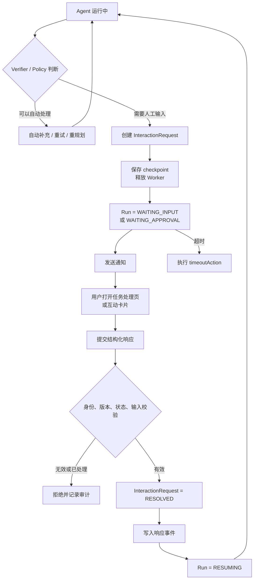

# 无对话框 Agent 的人工介入交互设计

> [!abstract]
> Agent 产品没有聊天窗口时，人工介入不应被设计成临时补一个对话框，而应被设计成异步任务处理：Agent 创建结构化 `InteractionRequest`，保存 checkpoint 并进入等待状态；系统通过任务中心、飞书卡片、邮件或业务回调通知负责人；用户提交一次性决策后，Agent 校验响应并从 checkpoint 恢复。

本设计是 [[ReAct循环中的预期结果验证设计|ReAct 循环中的预期结果验证设计]] 对 `UNKNOWN`、`ESCALATE` 和高风险审批场景的交互补充。

## 1. 核心结论

没有对话框不等于不能人机交互。只要 Agent 需要人工介入，系统就必须提供一个经过认证、可以接收用户决策的输入边界，但它不必是聊天窗口。

推荐产品形态：

```text
异步 Agent 任务
  + 任务中心
  + 结构化处理单
  + 通知渠道
  + checkpoint/resume
```

用户不需要与 Agent 进行连续对话，只需处理一张包含背景、原因、证据和可选动作的待办。

## 2. 什么时候需要人工介入

不是所有 `UNKNOWN` 都应打扰用户。建议按以下顺序处理：

```text
Agent 能否通过其他工具或数据源自行补充信息？
  -> 能：自动补充并重新验证
  -> 不能：继续判断

是否存在预先批准的低风险默认策略？
  -> 有：执行默认策略并留下审计记录
  -> 无：继续判断

是否影响业务结果、用户权益或关键结论？
  -> 是：创建人工处理单

是否涉及资金、权限、删除、发布等高风险动作？
  -> 是：强制人工审批
```

典型介入场景：

| 场景 | 原因 | 交互类型 |
| --- | --- | --- |
| Verifier 无法判断 | 缺少事实、证据或业务上下文 | 补充信息 / 提供证据 |
| 多个方案都满足目标 | 取舍依赖业务偏好 | 单选 / 多选 |
| 高风险工具准备执行 | 涉及资金、权限、删除或发布 | 批准 / 拒绝 |
| 缺少必填参数 | 无法继续调用工具 | 结构化表单 |
| 连续失败或预算耗尽 | 自动重试已经没有新增进展 | 继续 / 重规划 / 终止 |
| 结果本质主观 | 无法通过规则或 Judge 确认 | 用户验收 |

## 3. 总体交互流程



关键原则：

1. Agent 进入等待状态前必须持久化，而不是占用 HTTP 连接或 Worker；
2. 用户响应必须作为新事件写入，不直接修改旧执行记录；
3. 恢复时使用原 checkpoint、验证契约版本和待处理请求版本；
4. 同一个请求只能成功处理一次；
5. 超时必须有明确结果，不能无限等待。

## 4. 状态机

现有 Agent run 状态需要增加暂停和恢复状态：

```text
RUNNING
  -> WAITING_INPUT
  -> WAITING_APPROVAL
  -> RESUMING
  -> RUNNING

WAITING_INPUT / WAITING_APPROVAL
  -> RESOLVED
  -> REJECTED
  -> EXPIRED
  -> CANCELLED

Run 终态
  -> SUCCESS
  -> PARTIAL
  -> FAILED
  -> ESCALATED
  -> ABORTED
  -> EXPIRED
```

建议将 `InteractionRequest` 状态与 Agent run 状态分开：

| InteractionRequest 状态 | 含义 |
| --- | --- |
| `OPEN` | 等待用户处理 |
| `RESOLVED` | 已提交有效响应 |
| `REJECTED` | 用户明确拒绝 |
| `EXPIRED` | 超过处理期限 |
| `CANCELLED` | Agent run 被取消或请求失效 |
| `SUPERSEDED` | 已被更新版本的请求替代 |

## 5. InteractionRequest 结构

一张处理单至少需要说明：

- 为什么暂停；
- 当前已经完成什么；
- 缺少什么或需要决定什么；
- 依据和风险是什么；
- 用户有哪些可选动作；
- 每个动作会产生什么影响；
- 最晚何时处理；
- 超时后的默认动作。

示例：

```json
{
  "requestId": "ir-20260724-001",
  "requestVersion": 1,
  "tenantId": "tenant-01",
  "runId": "run-123",
  "stepId": "step-7",
  "contractVersion": 2,
  "type": "RESOLVE_UNKNOWN",
  "status": "OPEN",
  "title": "无法确认报告中的成本数据",
  "reason": "当前资料不能支持成本降低 30% 的结论",
  "completedSummary": "报告结构和其他关键结论已经通过验证",
  "evidence": [
    {
      "label": "报告第 3 节",
      "ref": "artifact://report-v2.md#成本"
    },
    {
      "label": "定价来源",
      "ref": "source://official-doc-1#pricing"
    }
  ],
  "actions": [
    {
      "id": "REMOVE_CLAIM",
      "label": "删除该结论",
      "risk": "LOW"
    },
    {
      "id": "PROVIDE_EVIDENCE",
      "label": "补充证据",
      "risk": "LOW",
      "inputSchema": {
        "type": "object",
        "required": ["sourceUrl"],
        "properties": {
          "sourceUrl": {
            "type": "string",
            "format": "uri"
          }
        }
      }
    },
    {
      "id": "ABORT",
      "label": "终止任务",
      "risk": "MEDIUM"
    }
  ],
  "allowedResponders": ["role:report-owner"],
  "createdAt": "2026-07-24T16:00:00+08:00",
  "expiresAt": "2026-07-25T18:00:00+08:00",
  "timeoutAction": "ABORT"
}
```

## 6. InteractionResponse 结构

用户提交的响应也必须结构化并具备幂等性：

```json
{
  "responseId": "resp-001",
  "requestId": "ir-20260724-001",
  "requestVersion": 1,
  "idempotencyKey": "user-42-ir-20260724-001-v1",
  "actionId": "PROVIDE_EVIDENCE",
  "input": {
    "sourceUrl": "https://example.com/official-cost-report"
  },
  "responder": {
    "userId": "user-42",
    "tenantId": "tenant-01"
  },
  "respondedAt": "2026-07-24T16:30:00+08:00"
}
```

服务端处理顺序：

```text
验证登录身份与 tenant
  -> 验证 responder 是否有处理权限
  -> 验证 request 仍为 OPEN
  -> 验证 requestVersion
  -> 验证 actionId 和 inputSchema
  -> 使用 idempotencyKey 去重
  -> 原子更新 request 为 RESOLVED
  -> 追加 InteractionResolved 事件
  -> 调度 Agent resume
```

## 7. 交互控件选择

优先使用结构化控件，只有无法结构化时才使用自由文本。

| 需求 | 推荐控件 |
| --- | --- |
| 是否允许动作 | 批准 / 拒绝按钮 |
| 选择一个处理方案 | 单选 |
| 选择多个补充项 | 多选 |
| 输入订单号、金额、日期 | 类型化表单 |
| 补充事实依据 | URL、文件上传或数据源选择 |
| 确认结果是否可接受 | 接受 / 要求修改 |
| 复杂业务说明 | 自由文本，附 Schema 和长度限制 |

不推荐默认提供一个空白文本框，因为它会把歧义重新交给 Agent 理解，可能再次触发 `UNKNOWN`。

## 8. 产品入口

### 8.1 有 Web 管理端

建议增加两个工作面：

```text
我的任务
  -> 运行中
  -> 待我处理
  -> 已完成
  -> 失败

任务详情
  -> 当前状态
  -> 已完成摘要
  -> 暂停原因
  -> 证据与风险
  -> 操作按钮或表单
  -> 执行轨迹
```

任务列表优先展示：优先级、剩余处理时间、风险等级、负责人和暂停原因。用户不需要先阅读完整 Agent trace 才能做决定。

### 8.2 没有 Web 管理端

可以使用：

- 飞书或企业微信互动卡片；
- 邮件中的一次性签名链接；
- 公司现有审批系统；
- Webhook 通知业务系统，由业务系统回调；
- 管理 API 或 CLI。

通知渠道只负责到达用户，`InteractionRequest` 服务仍是权威状态源。不能把“飞书消息是否发送成功”当作“用户已经处理”。

## 9. 通知设计

通知内容应尽量短，只呈现完成决策所需的信息：

```text
标题：报告任务需要补充证据
原因：成本降低 30% 的结论缺少来源
影响：未处理前报告不能发布
截止时间：明天 18:00
操作：删除结论 / 补充证据 / 终止任务
```

通知策略：

1. 创建请求时发送首条通知；
2. 临近超时前提醒一次；
3. 高风险请求按组织规则升级负责人；
4. 请求已处理、取消或替代后，旧通知操作必须失效；
5. 通知失败不改变请求状态，由独立重试机制处理。

## 10. checkpoint 与恢复

进入等待状态时至少保存：

```text
run_id / step_id
Agent state
对话或消息上下文引用
验证契约 ID 和版本
Prompt / Model / Tool Schema 版本
待处理 InteractionRequest ID 和版本
已完成副作用及其幂等键
剩余预算
下一恢复节点
```

恢复流程：

```text
收到有效 InteractionResponse
  -> 获取 run lease
  -> 校验 run 仍在对应等待状态
  -> 加载 checkpoint
  -> 追加用户决策为新事件
  -> 跳转到约定恢复节点
  -> 重新执行必要的 Step/Goal Verification
  -> 继续 Agent 循环
```

恢复不是重新从头运行。已经产生的副作用不能再次执行；如确实需要重放，工具必须依赖稳定幂等键。

## 11. 超时和默认动作

每种请求类型必须显式定义 `expiresAt` 和 `timeoutAction`。

| 场景 | 推荐超时动作 |
| --- | --- |
| 查询类低风险参数缺失 | 使用已批准默认值或返回 `PARTIAL` |
| 事实无法确认 | 标记 `UNKNOWN`，不发布相关结论 |
| 高风险写操作审批 | 默认拒绝或 `ABORT` |
| 资金、删除、权限变更 | 绝不能默认批准 |
| 请求被新版本替代 | `SUPERSEDED`，禁止旧响应恢复任务 |

超时后应通知负责人最终结果，并保留当时未通过的条件和证据。

## 12. 安全与审计

必须具备：

- tenant、用户和角色绑定；
- 最小权限检查；
- 一次性或短时效签名链接；
- request version 和乐观锁；
- response idempotency key；
- 完整审批人与操作时间审计；
- 敏感字段脱敏；
- 附件病毒扫描和内容安全检查；
- 防止候选内容通过提示注入操纵处理页面或 Judge。

不要通过普通文本字段收集密码、API key 或数据库凭据。需要授权时，应跳转到专门的凭据管理或 OAuth 流程，只把授权引用返回给 Agent。

## 13. API 边界示例

```text
POST /internal/interaction-requests
  # Agent runtime 创建请求

GET /interaction-requests?assignee=me&status=OPEN
  # 用户任务列表

GET /interaction-requests/{requestId}
  # 获取处理上下文

POST /interaction-requests/{requestId}/responses
  # 提交一次性响应

POST /interaction-requests/{requestId}/cancel
  # 取消尚未处理的请求

POST /internal/agent-runs/{runId}/resume
  # Interaction 服务触发恢复，不直接暴露给终端用户
```

`POST responses` 应采用条件更新：只有 `status=OPEN` 且版本匹配时才能写入，避免双击、多人同时审批或过期卡片重复恢复任务。

## 14. 最小落地方案

第一版不需要建设完整聊天系统，最小闭环包括：

1. Agent run 增加 `WAITING_INPUT`、`WAITING_APPROVAL` 和 `RESUMING`；
2. 建立 `InteractionRequest`、`InteractionResponse` 和审计表；
3. 支持批准/拒绝、单选和简单表单；
4. 提供一个“待我处理”页面；
5. 接入一个通知渠道；
6. 支持 checkpoint/resume；
7. 实现超时、幂等、版本和权限校验；
8. 对恢复后的结果重新运行 Verifier。

后续再增加文件上传、多级审批、移动端卡片、代理审批和 SLA 升级，不应在第一版先构建通用会话平台。

## 15. 最终建议

对于没有对话框的 Agent 产品，采用以下默认设计：

```text
正常情况下无人值守执行
  -> 只有 UNKNOWN、硬审批或预算耗尽时暂停
  -> 创建结构化 InteractionRequest
  -> 保存 checkpoint 并释放 Worker
  -> 通过任务中心和通知渠道让用户做一次性决策
  -> 校验响应并幂等恢复
  -> 重新验证后继续执行
```

产品上的交互主体不是“聊天消息”，而是“需要处理的 Agent 任务”。这既能保持无对话框的产品形态，也能让不得不发生的人工介入具备明确状态、权限、超时和审计语义。
