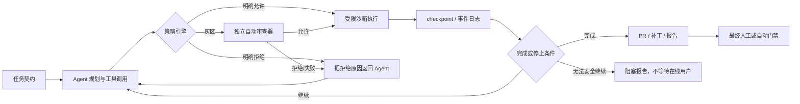

# Agent 免中途确认与无人值守执行方案调研

> **结论先行**：存在不需要用户中途确认的方案，而且已经不是单一的“YOLO 模式”。截至 **2026-07-24**，主流实现可归纳为四类：关闭确认但保留沙箱、基于规则的预授权、由独立审查模型自动批准、在隔离环境中后台执行并把人工审查移到最终 PR/制品边界。生产环境优先采用后三者的组合；“无沙箱 + 自动批准一切”只适合一次性容器或可随时销毁的实验环境。
>
> 本文讨论的是通用 Agent，重点用编码 Agent 验证方案，因为它们同时具备文件、命令、网络、浏览器和外部工具等高风险能力，确认机制最完整。文中的“无人值守”是指运行期间不进入 `WAITING_FOR_USER`，不等于任务一定成功，也不等于可以跳过最终结果审查。

## 1. 核心判断

### 1.1 确实可以做到不中途确认

当前已有三条成熟路径：

1. **不询问，越权即失败**：Agent 在预先给定的工作区、工具和网络范围内自动执行；遇到边界外动作直接拒绝或结束，而不是询问用户。Codex 的 `approval_policy = "never"`、Claude Code 的 `dontAsk`、Gemini CLI 非交互模式下把 `ask_user` 当成 `deny`，都属于这一类。[S1][S4][S7]
2. **不询问，由策略或审查器代决策**：工具调用先经过规则引擎或独立审查模型，自动得到允许/拒绝。Codex `approvals_reviewer = "auto_review"`、Claude Code `auto`、Gemini CLI Policy Engine、OpenHands `LLMSecurityAnalyzer` 已提供产品化实现。[S1][S4][S8][S10]
3. **不询问，在隔离环境做完后交付制品**：Agent 在临时容器或云端工作区运行，只能写自己的分支，完成后交付 PR、补丁或报告。GitHub Copilot cloud agent 是典型实现：后台工作、单分支写入、最终由人审查和合并。[S16][S17]

最不推荐但也确实存在的第四条路径，是 `--yolo`、`bypassPermissions`、`NeverConfirm()` 或“始终 Yes”：它们减少的是控制，不只是交互。[S1][S4][S6][S9][S11][S13][S15]

### 1.2 “免确认”至少有三个不同含义

| 中断类型 | 典型问题 | 权限模式能否解决 | 真正无人值守的处理方式 |
| --- | --- | --- | --- |
| 工具权限确认 | “是否允许执行命令/联网/写文件？” | 能 | 预授权、自动审查，或拒绝后让 Agent 换方案 |
| 业务澄清 | “字段 A 还是 B？部署到哪个环境？” | 不能完全解决 | 启动前写清默认值；运行中按保守规则选择并记录假设，无法安全选择则失败退出 |
| 最终结果审查 | “是否合并、发布、付款？” | 不应一概消除 | 把审查集中到最终 PR、制品或高影响动作边界 |

很多工具宣称“自动批准”，只覆盖第一行。若 Agent 仍能调用提问工具、遇到歧义就停住，或流程本身有 `interrupt()` 节点，它仍不是真正的无人值守运行。

### 1.3 免中途确认不等于无限权限

这两个维度应分开配置：

```text
                    权限范围窄                         权限范围宽
需要人工确认        安全但频繁打断                     高风险动作逐次批准
无需人工确认        推荐：受限能力内自治，越界失败       危险：主机级 YOLO / bypass
```

推荐目标是左下角：**不给 Agent 任意权限，但在已经授予的能力范围内不再打断用户。**

## 2. 现成方案横向比较

### 2.1 能力矩阵

| 方案 | 可否免中途确认 | 免确认机制 | 越界/高风险时 | 隔离能力 | 适合场景 |
| --- | --- | --- | --- | --- | --- |
| **Codex CLI / `exec`** | 可以 | `-a never`；或 `auto_review` 自动审查 | `never` 下在沙箱内尽力执行，越界失败；自动审查可批准或拒绝并 fail closed | 原生 OS 沙箱，工作区写入、网络策略、容器外层隔离 | 本地开发、CI、批处理；当前综合方案最完整之一 [S1] |
| **Claude Code** | 条件性可以 | `auto` 用独立分类器审查；`dontAsk` 只运行预批准工具；`bypassPermissions` 跳过大部分提示 | `auto` 会拦截超出请求/不可信基础设施/恶意内容的动作；显式 `ask` 和根目录删除等断路器仍可能提示 | OS 沙箱可让受限 Bash 自动运行；推荐容器/VM 承载 bypass [S3][S4][S5] |
| **Gemini CLI** | 可以 | headless + `yolo`；或 Policy Engine 的 `allow/deny` | 非交互模式中的 `ask_user` 自动按 `deny` 处理 | `yolo` 默认启用沙箱；支持 Seatbelt、Docker/Podman、gVisor、LXC 等 [S6][S7][S8] |
| **OpenHands** | 可以 | headless 固定为 `always-approve`；SDK 有 `NeverConfirm()` | headless 不提供确认入口；SDK 可改为 `ConfirmRisky()` + 独立风险分析器 | Docker sandbox 是本地推荐默认；Process sandbox 明确标为不安全 [S9][S10][S11] |
| **Cline** | 可以 | 按文件、命令、浏览器、MCP 分类 Auto Approve；YOLO 全开 | YOLO 不再检查，连推送、系统命令和外部请求都可直接执行 | 产品文档主要依赖工作区边界、Git checkpoint；强隔离需外部容器 [S12][S13] |
| **Roo Code** | 可以 | 细粒度 Auto-Approve；命令 allow/deny 前缀；问题超时自动选默认答案 | 未预授权项仍会停；配置问题默认答案后可继续夜间任务 | 工作区/保护文件边界，命令拒绝表；系统级隔离需外部提供 [S14] |
| **GitHub Copilot cloud agent** | 运行中可以 | 云端后台 Agent，不逐工具询问 | 只能写指定仓库的单个分支；最终 PR 需人工审查/合并；Actions 默认还需批准，可由管理员关闭 | 临时 Actions 环境、网络限制、分支和凭证约束、审计日志 | issue 到 PR、批量维护、定时自动化 [S16][S17] |
| **Aider** | 可以 | `--yes-always` 对每个确认回答 Yes | 不提供同等级的自动审查或原生隔离语义 | 依赖运行它的外部环境 | 受信任小任务、容器内轻量自动修改 [S15] |

### 2.2 Codex：三档可用方案

Codex 把“何时询问”与“技术上允许做什么”拆成批准策略和沙箱两层。[S1]

**受限无人值守，推荐用于 CI 或本地批处理：**

```bash
codex --sandbox workspace-write --ask-for-approval never exec "完成任务并运行测试"
```

这不会弹出确认，但也不会自动获得沙箱外权限。需要访问未授权路径或网络时，正确结果是失败或改走其他路径，不是停下来问用户。

**自动审查，推荐用于需要一定弹性但不想人工值守的长任务：**

```bash
codex \
  --sandbox workspace-write \
  --ask-for-approval on-request \
  -c approvals_reviewer=auto_review
```

自动审查器只接管原本需要批准的动作，检查数据外泄、凭证探测、持久性削弱和破坏性操作；关键风险拒绝，审查失败或解析失败时 fail closed。它比“永远批准”更接近生产可用的无人值守。[S1]

**完全绕过，不推荐在宿主机使用：**

```bash
codex --dangerously-bypass-approvals-and-sandbox
```

该模式同时去掉批准和沙箱。只有当外层一次性容器、挂载、网络和凭证已经构成完整边界时才有合理性。

### 2.3 Claude Code：自动审查与预授权两条路线

Claude Code 当前提供多个容易混淆的模式：[S3][S4]

- `auto`：后台分类器逐动作审查，减少常规批准提示；适合长任务，但不是绝对零提示，显式 `ask` 规则、交互型 MCP 工具和关键删除断路器仍保留。
- `dontAsk`：只执行已在规则中预批准的工具，其余自动拒绝；这是 CI/脚本场景更可预测的无提示模式。
- `bypassPermissions`：跳过大多数权限检查，但官方只建议隔离容器或 VM，而且仍存在少量强制提示。

```bash
# 自动审查，减少人工批准
claude -p "完成任务并运行验证" --permission-mode auto

# 严格预授权；未授权工具直接拒绝，不询问
claude -p "完成任务并运行验证" --permission-mode dontAsk
```

`auto` 还会提示 Agent 尽量持续工作、不因普通澄清问题停下，但请求或 skill 明确依赖用户输入时仍可能提问。因此，无人值守任务仍应提供启动契约，不能只切换权限模式。[S4]

### 2.4 Gemini CLI：headless + 策略引擎

Gemini CLI 的组合较适合脚本化：[S6][S7][S8]

```bash
gemini \
  -p "完成任务并运行验证" \
  --approval-mode yolo \
  --sandbox \
  --output-format stream-json
```

`yolo` 自动批准全部工具，官方配置文档说明该模式默认启用沙箱。更稳妥的做法是使用 Policy Engine：按工具名、参数正则、命令前缀、MCP 服务、子 Agent 和交互/非交互环境给出 `allow`、`deny`、`ask_user`。在 headless 模式中，`ask_user` 会自动变成 `deny`，所以流程不会等待人。

需要注意：当前官方文档同时标注 workspace 级 policy 尚未生效，应使用 User 或 Admin policy，不能假设仓库内 `.gemini/policies` 已形成安全边界。[S8]

### 2.5 OpenHands：真正的 headless，但必须认真选择 sandbox

OpenHands 的 headless 模式语义最直接：[S9]

```bash
openhands --headless --json -t "完成任务并运行验证"
```

官方明确说明：headless **始终**运行在 `always-approve`，不能改用逐次批准。OpenHands SDK 还提供 `NeverConfirm()`、`AlwaysConfirm()`、`ConfirmRisky()`，后者可搭配独立 LLM 安全分析器。[S10]

这意味着安全性主要取决于执行环境。官方推荐 Docker sandbox，Process sandbox 则明确没有容器隔离。[S11] 因此 headless 应运行在临时容器或远程 sandbox，只挂载任务所需目录和最小凭证。

### 2.6 Cline、Roo Code 与 Aider：适合本地提效，不宜裸奔

**Cline** 提供两档设置：[S12][S13]

- Auto Approve 可分别允许工作区读写、安全/全部命令、浏览器和 MCP；
- YOLO 会立即批准所有文件、命令、浏览器、MCP 和模式切换，官方明确警告它会关闭所有安全检查。

Cline checkpoint 使用独立 shadow Git 保存每次工具调用后的文件状态，适合最终回看和回滚，但 checkpoint 不能撤回已经发送的邮件、推送、部署或数据库写入。

**Roo Code** 的颗粒度更细：[S14]

- 命令可配置 allow/deny 前缀，匹配冲突时更具体的规则优先，同等具体度下 deny 优先；
- 可限制工作区外读写和保护文件；
- 可在 1～300 秒后自动选择跟进问题的第一个建议答案，官方直接把 overnight run 列为使用场景。

这项“问题默认回答”补上了很多 Auto Approve 工具的缺口，但默认选择未必符合业务意图。只应对可逆、低影响问题启用。

**Aider** 的 `--yes-always` 会对所有确认回答 Yes。[S15] 它简单有效，但控制面最薄，应把沙箱、网络、凭证和最终 diff 审查全部放到外层。

### 2.7 GitHub Copilot cloud agent：把批准移到 PR 边界

GitHub Copilot cloud agent 展示了更适合团队的模式：[S16][S17]

```text
任务/事件触发
   -> 临时云端开发环境
   -> 研究、修改、测试、提交
   -> 仅推送 Agent 自己的分支
   -> 生成 PR 和完整日志
   -> 人工审查并合并
```

运行过程中用户不需要逐工具批准。安全性来自：仅有写权限的用户能触发、Agent 只写一个分支、凭证能力受限、网络受控、提交和日志可审计、Agent 不能批准或合并自己的 PR。

GitHub Actions 默认不会在 Agent PR 上自动运行，需要有写权限的用户批准；管理员可以关闭该要求，但官方警告未审查代码可能借工作流获得仓库写权限或读取 Actions secrets。[S17] 因此推荐保留最终审查，即“不中途确认，但不自动进入生产”。

## 3. 推荐的通用架构

### 3.1 最佳实践不是取消批准，而是替换批准主体和时点



核心变化有两点：

1. 权限不再通过聊天临时扩大，而是在运行前形成可审计的能力包；
2. 无法继续时产出明确的 blocked 结果，而不是无限期等待用户回答。

### 3.2 任务契约：先消灭业务澄清型中断

启动 Agent 前至少提供以下字段：

| 字段 | 示例 | 缺失后的默认行为 |
| --- | --- | --- |
| 目标 | 修复 issue #123 并补回归测试 | 不自行扩大到相邻重构 |
| 允许范围 | 当前仓库、`feature/agent-*` 分支 | 禁止修改其他仓库和用户目录 |
| 验收标准 | 指定测试通过、无新增 lint error | 无法验证则报告未完成 |
| 决策默认值 | 保持兼容；不引入新依赖；优先最小改动 | 记录假设后采用最保守选项 |
| 外部副作用 | 可建分支/提交；不可推生产、发消息、删数据 | 未明确列出的副作用一律拒绝 |
| 预算 | 60 分钟、100 次工具调用、固定 token/金额 | 到限后保存状态并结束 |
| 停止条件 | 测试连续失败 3 次、策略拒绝且无替代路径 | 输出原因、证据和下一步，不询问 |
| 交付物 | PR、patch、JSON 状态、测试报告 | 不直接发布业务结果 |

建议在系统提示或工作流状态中加入明确规则：

```text
遇到可逆歧义：选择最保守且最小影响的方案，记录 assumption 后继续。
遇到信息缺失：先使用已授权的只读工具查证。
遇到权限拒绝：尝试不扩大权限的替代方案。
涉及不可逆或高影响业务决策：不猜测，不等待在线用户；停止并输出 blocked 报告。
```

### 3.3 能力包：预授权具体能力，不授予抽象的“管理员权限”

一个可审计的能力包应包含：

- 文件：只读根目录、可写根目录、保护路径；
- 命令：允许的程序/子命令/参数模式，明确拒绝 shell 拼接和危险重定向；
- 网络：域名、端口、方法、是否允许本地/私网地址；
- 外部 API：资源类型、租户、环境、最大影响范围；
- 凭证：短期 token、最小 scope、任务结束即撤销；
- 预算：时间、步骤、并发、费用、重试次数；
- 副作用：哪些动作可自动提交，哪些只能生成 proposal。

Gemini Policy Engine 的 `allow/deny/ask_user`、Codex 的沙箱/网络规则、Claude permission rules、Roo 命令 allow/deny 前缀，都是这一思想的现成实现。[S1][S3][S8][S14]

### 3.4 自动审查器：只处理灰区，不替代硬边界

自动审查模型适合判断：

- 动作是否与原始请求一致；
- 是否疑似数据外泄、凭证探测或提示注入；
- 是否在修改生产基础设施或绕过安全控制；
- 删除、推送、发布等动作是否已被明确授权；
- 工具参数是否超出命名资源的范围。

它不应决定操作系统级边界。正确顺序是：

```text
硬 deny 规则 > 硬 allow 规则 > 自动审查灰区 > 默认拒绝
```

Codex auto-review 的审查失败即关闭、Claude auto 的受信基础设施配置、OpenHands 独立 `LLMSecurityAnalyzer` 都说明审查器本身也会失败，必须 fail closed。[S1][S4][S10]

### 3.5 Durable execution：长任务不能依赖一个终端会话

免确认之后，新的主要中断来源会变成进程崩溃、网络超时、限流和宿主重启。应把运行状态持久化：

- 每个节点或工具调用前后保存 checkpoint；
- 外部副作用使用幂等键，不能把工作流重放当成副作用幂等；
- 重试有上限和退避，永久错误进入终止状态；
- 保存 Agent/提示/工具 schema 版本，避免旧状态由新定义错误恢复；
- 任务完成、失败、策略拒绝、预算耗尽都必须是显式终态。

LangGraph checkpointer 支持中断后继续和故障恢复；Temporal 通过事件历史在崩溃后从上一个成功点恢复；OpenAI Agents SDK 的 `RunState` 可序列化批准决策并恢复。[S2][S18][S19][S20]

### 3.6 把不可逆动作放到最终边界

适合全自动执行：

- 仓库内代码和测试修改；
- 临时分支提交；
- 只读检索和诊断；
- 沙箱内构建、lint、测试；
- 生成 PR、补丁、报告和待执行计划。

不应默认全自动：

- 生产部署、数据库迁移和数据删除；
- 付款、退款、权限授予和密钥轮换；
- 对外发信、公告和社交媒体发布；
- 合并到受保护分支；
- 修改 CI/CD 以获取 secrets 或放宽安全门禁。

后一组可以做到“不中途打断”：让 Agent 先完整生成变更和证据，最后集中审批一次。GitHub cloud agent 的“后台完成 + 人工合并”就是这一模式。[S17]

## 4. 自治等级与推荐配置

| 等级 | 行为 | 人工交互 | 典型配置 | 建议 |
| --- | --- | --- | --- | --- |
| U0 手动 | 写文件、命令、网络逐次确认 | 高频 | 默认 permission mode | 敏感探索期 |
| U1 编辑自治 | 工作区编辑自动，命令/外部动作确认 | 中等 | Claude `acceptEdits`、Gemini `auto_edit` | 日常结对开发 |
| U2 受限无人值守 | 预授权范围自动执行，越界拒绝 | 运行中为零 | Codex `never + workspace-write`、Claude `dontAsk`、Gemini headless + policy | **CI/批处理默认推荐** |
| U3 审查器自治 | 灰区交给独立模型，硬边界仍由策略/沙箱控制 | 运行中通常为零 | Codex `auto_review`、Claude `auto`、OpenHands `ConfirmRisky + analyzer` | **长任务和生产辅助推荐** |
| U4 制品自治 | 云端/容器后台完成，只在最终 PR/制品审查 | 中途为零，最终一次 | GitHub cloud agent、自建临时 worker | **团队代码交付推荐** |
| U5 无限制自治 | 无沙箱、无批准、广泛凭证 | 零 | `--yolo` / bypass / all commands | 仅一次性、无敏感数据环境 |

推荐不是一路升到 U5。多数组织的目标应是 **U2 + U3 + U4**：范围内不打断，灰区自动审查，最终结果留有合并或发布门禁。

## 5. 按场景选型

### 5.1 本地仓库长任务

优先顺序：

1. 新 worktree/临时分支，确保工作区起点干净；
2. Codex `auto_review` 或 Claude `auto`；
3. 只开放工作区写入和依赖所需的网络域名；
4. 禁止生产凭证、推送受保护分支和部署；
5. 最终看 diff、测试结果和审计日志。

### 5.2 CI、定时任务和批处理

使用不会等待输入的模式：

- Codex `exec + approval never`；
- Claude `-p + dontAsk` 和显式 allow rules；
- Gemini `-p` + Policy Engine，`ask_user` 自动拒绝；
- OpenHands headless + Docker sandbox。

统一要求进程输出结构化终态：`succeeded`、`failed`、`blocked_by_policy`、`budget_exhausted`、`needs_final_review`。不要让 CI job 以“等待批准”挂住。

### 5.3 Issue 到 PR

首选远程 Agent 或自建临时 worker：每个任务创建独立环境和分支，只允许产出 PR。保留分支保护、必需检查和最终合并审查。GitHub Copilot cloud agent 已把这套边界产品化。[S16][S17]

### 5.4 夜间探索和原型

Roo Code 的自动跟进答案、Cline Auto Approve、Aider `--yes-always` 可以减少本地等待，但应满足：

- 一次性容器或可回滚虚拟机；
- 不挂载用户主目录和 SSH/云凭证；
- 网络按域名限制；
- 只操作临时分支；
- 有时间、费用、步骤和连续失败上限；
- 早晨只验收制品，不信任“任务完成”文本本身。

### 5.5 生产运维或业务动作

不要直接使用通用编码 Agent 的 YOLO。采用自建工作流：确定性流程管理状态，Agent 只在受限节点做判断，策略引擎和自动审查器处理工具调用，Temporal/LangGraph 一类 durable runtime 管理恢复，最终高影响动作进入单一审批边界。[S18][S19][S20]

## 6. 落地检查表

### 6.1 运行前

- [ ] 任务目标、验收标准和默认决策已写入任务契约
- [ ] Agent 使用独立分支、worktree、容器或远程 sandbox
- [ ] 只挂载必要目录，主目录和其他仓库不可见
- [ ] 网络采用 allowlist，私网和本地服务默认不可达
- [ ] 凭证短期、最小权限、限定环境和资源
- [ ] 删除、推送、发布、部署和外部消息有明确 policy
- [ ] 设置时间、token、费用、步骤、重试和连续失败上限

### 6.2 运行中

- [ ] 所有工具调用及策略决策进入不可变审计日志
- [ ] 策略无法判断或审查器失败时默认拒绝
- [ ] 被拒绝的动作把原因返回 Agent，允许其尝试更安全方案
- [ ] checkpoint 可跨进程恢复，外部副作用具备幂等键
- [ ] 支持 kill switch 和凭证即时撤销
- [ ] 遇到歧义按既定规则继续或终止，不进入无限等待

### 6.3 运行后

- [ ] 交付 diff/PR/报告，而不是只输出“已完成”
- [ ] 独立运行测试、lint、安全扫描和策略检查
- [ ] 检查未授权文件、依赖、网络目标和外部副作用
- [ ] 高影响动作仍需最终门禁
- [ ] 清理临时环境并撤销 token
- [ ] 记录失败类型，为下一轮收紧任务契约或 policy

## 7. 最终建议

如果目标只是“不想频繁点确认”，不必直接切到危险模式：

1. **个人本地开发**：先用 Codex auto-review 或 Claude auto；工作区外、生产和广泛网络保持禁止。
2. **脚本/CI**：用“无提示但越权拒绝”的 U2，而不是“自动同意所有权限”的 U5。
3. **团队代码交付**：把 Agent 放到临时云端环境，只写独立分支，以 PR 作为最终边界。
4. **自建业务 Agent**：采用 capability policy + 自动审查器 + sandbox + durable execution；不可逆动作集中到最终审批。
5. **绝对零交互**：明确规定遇到未授权或无法安全判断时输出 blocked 终态。真正的无人值守系统必须会安全失败，而不是为了“继续运行”自动扩大权限。

因此，答案是：**存在不需要用户中途确认的方案；最可靠的方案不是取消所有确认，而是将确认前移为权限契约、自动化为策略审查、后移为最终制品门禁。**

## 8. 一手来源

> 本文优先使用产品官方文档和官方开源仓库。能力和命令行参数变化很快，落地时应针对固定版本再次验证。

- **[S1] OpenAI / Codex**：[Agent approvals & security](https://learn.chatgpt.com/docs/agent-approvals-security) — 沙箱与批准分层、`never`、auto-review、`--yolo`、非交互执行与容器建议。
- **[S2] OpenAI Agents SDK**：[Human-in-the-loop](https://openai.github.io/openai-agents-python/human_in_the_loop/) — 工具批准、程序化批准回调、`RunState` 持久化和恢复。
- **[S3] Anthropic / Claude Code**：[Configure permissions](https://code.claude.com/docs/en/permissions) — permission rules、`dontAsk`、`bypassPermissions` 与沙箱关系。
- **[S4] Anthropic / Claude Code**：[Choose a permission mode](https://code.claude.com/docs/en/permission-modes) — `auto` 审查器、各模式边界及高风险动作处理。
- **[S5] Anthropic / Claude Code**：[Sandboxing](https://code.claude.com/docs/en/sandboxing) — 文件系统、网络隔离和沙箱内自动允许。
- **[S6] Google / Gemini CLI**：[CLI reference](https://github.com/google-gemini/gemini-cli/blob/main/docs/cli/cli-reference.md) 与 [Headless mode](https://github.com/google-gemini/gemini-cli/blob/main/docs/cli/headless.md) — `--approval-mode`、`yolo`、headless 和结构化输出。
- **[S7] Google / Gemini CLI**：[Configuration](https://github.com/google-gemini/gemini-cli/blob/main/docs/reference/configuration.md) 与 [Sandboxing](https://github.com/google-gemini/gemini-cli/blob/main/docs/cli/sandbox.md) — yolo 默认沙箱、sandbox provider 和网络控制。
- **[S8] Google / Gemini CLI**：[Policy Engine](https://github.com/google-gemini/gemini-cli/blob/main/docs/reference/policy-engine.md) — `allow/deny/ask_user`、优先级、headless 拒绝语义及当前 workspace policy 限制。
- **[S9] OpenHands**：[Headless Mode](https://docs.openhands.dev/openhands/usage/cli/headless) — headless 固定 `always-approve` 和 JSONL 输出。
- **[S10] OpenHands SDK**：[Security & Action Confirmation](https://docs.openhands.dev/sdk/guides/security) — `AlwaysConfirm`、`NeverConfirm`、`ConfirmRisky` 和独立 LLM 安全分析器。
- **[S11] OpenHands**：[Sandbox Overview](https://docs.openhands.dev/openhands/usage/sandboxes/overview) 与 [Docker Sandbox](https://docs.openhands.dev/openhands/usage/sandboxes/docker) — Docker、Process、Remote sandbox 的隔离差异。
- **[S12] Cline**：[Auto Approve & YOLO Mode](https://docs.cline.bot/features/auto-approve) — 细粒度自动批准和无检查 YOLO 模式。
- **[S13] Cline**：[Checkpoints](https://docs.cline.bot/core-workflows/checkpoints) — shadow Git checkpoint、回看与恢复边界。
- **[S14] Roo Code**：[Auto-Approving Actions](https://docs.roocode.com/features/auto-approving-actions) — 操作分类、命令 allow/deny、工作区边界及跟进问题超时默认回答。
- **[S15] Aider**：[Options reference](https://aider.chat/docs/config/options.html#--yes-always) — `--yes-always`。
- **[S16] GitHub Copilot**：[About GitHub Copilot cloud agent](https://docs.github.com/en/copilot/concepts/agents/cloud-agent/about-cloud-agent) — 临时环境、后台任务、独立分支和 PR 工作流。
- **[S17] GitHub Copilot**：[Risks and mitigations](https://docs.github.com/en/copilot/concepts/agents/cloud-agent/risks-and-mitigations) 与 [Review output](https://docs.github.com/en/copilot/how-tos/copilot-on-github/use-copilot-agents/review-copilot-output) — 分支/凭证/网络限制、人工合并和 Actions 批准。
- **[S18] LangGraph**：[Persistence](https://docs.langchain.com/oss/python/langgraph/persistence) — checkpointer、恢复和容错。
- **[S19] LangGraph**：[Interrupts](https://docs.langchain.com/oss/python/langgraph/interrupts) — 中断是显式工作流节点，状态持久化后可恢复。
- **[S20] Temporal**：[Understanding Temporal](https://docs.temporal.io/evaluate/understanding-temporal) — Durable Execution、事件历史、故障恢复和 Activity 重试。
