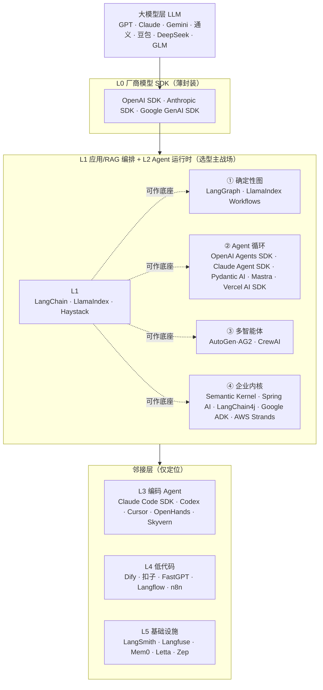
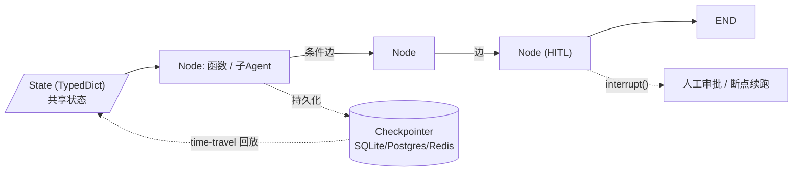
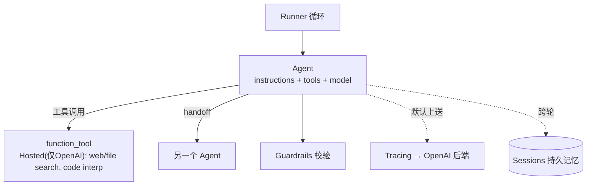
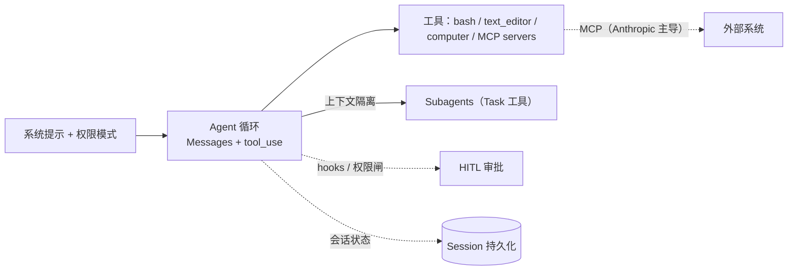
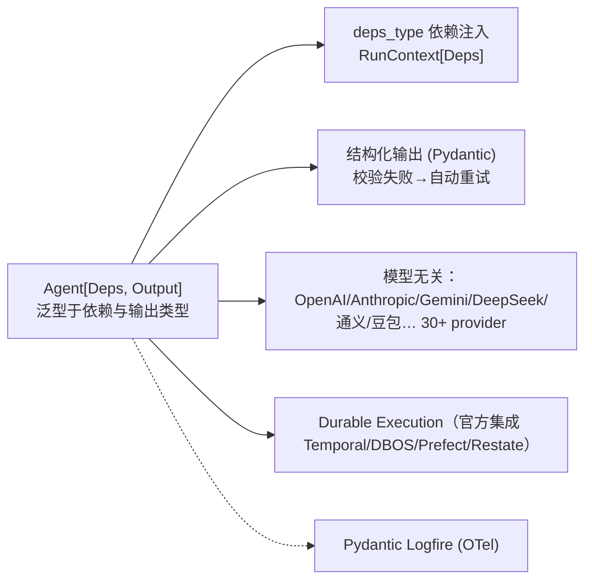
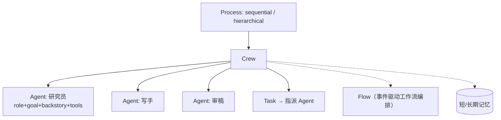
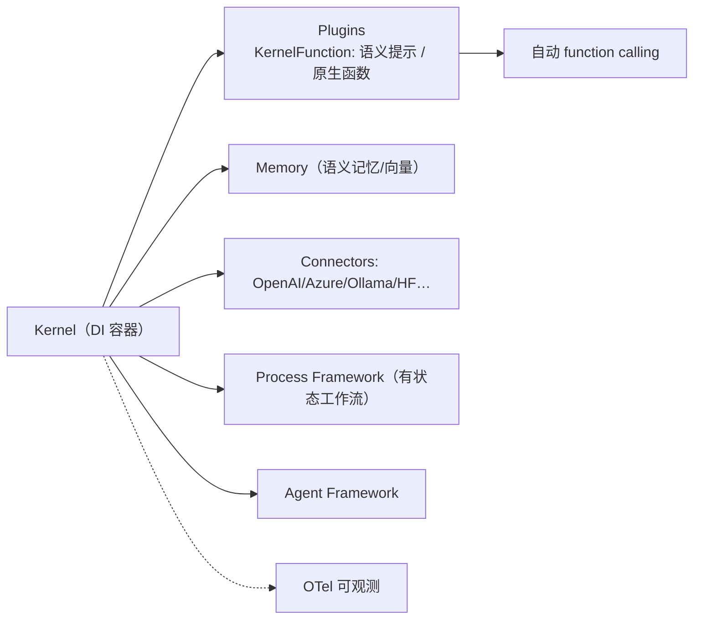
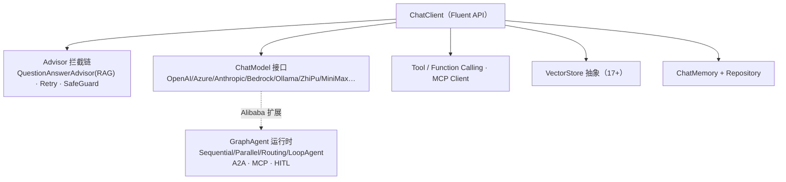
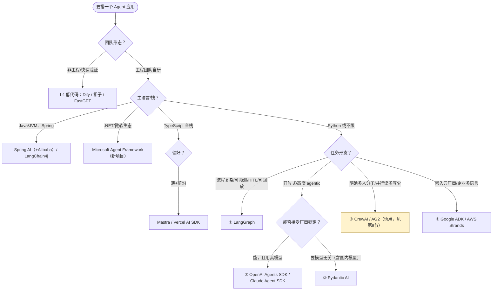

<!-- cSpell:words Agentic AutoGen Bedrock checkpointer CrewAI EvalOps Foundry guardrail handoff LangChain LangGraph LangSmith LlamaIndex Mastra Pydantic Semantic Strands toolset -->

# AI Agent 开发框架技术选型调研（2026 全景）

> 本文是一篇**通用全景调研**（非某个具体项目的选型），横向梳理 2026 年主流 Agent 开发框架的本质分野、能力取舍与选型方法。文档不裁决"唯一最佳框架"，而是给出"按约束→候选"的决策路径，以及落地所需的生产参考架构与 PoC 门禁。
>
> **方法论与可信度**：核心论断（厂商 SDK 锁定边界、AutoGen/AG2/MAF 演进、Pydantic AI / Vercel AI SDK / Mastra 版本与定位、多智能体争论、MCP 采纳、国内模型生态）来自 2026-07-24 直接抓取的官方文档/GitHub/官方博客等一手来源；少量架构描述基于成熟项目的稳定结构。**版本号与 GA 状态进入项目时仍应锁定版本并用第 11 节的 PoC 门禁复核。**
>
> 本文由两份初稿合并而成：一份以"控制流哲学"为全景主轴、含 2026-07 联网核实与决策树；另一份聚焦生产落地（生产参考架构、两阶段 PoC 门禁、迁移成本、Java 专项、协议）。合并后前者提供"为什么这么选"，后者提供"怎么落地验证"。

## 摘要

1. **"Agent 框架"不是一层，是六层。** 把 LangGraph、Dify、OpenAI SDK、扣子放在一起横比是无意义的——它们分别处于模型 SDK、应用编排、Agent 运行时、编码 Agent、低代码平台、配套基础设施六个生态位。选型第一步是**定位自己要在哪一层做决策**。

2. **真正的"选型主战场"是 Agent 运行时层（L2）**，可被一条主轴切开——**"谁来决定下一步干什么"**：① 你画的确定性图（LangGraph），② 模型自己跑的工具循环（OpenAI Agents SDK / Claude Agent SDK / Pydantic AI / Mastra），③ 多个 Agent 互相委派（CrewAI / AutoGen），④ 企业插件内核（Semantic Kernel / Spring AI / Google ADK / AWS Strands）。

3. **先判断是否真的需要 Agent。** 单次模型调用、RAG 或固定工作流能解决的问题，不应先引入自主 Agent——它用更高的延迟、成本和错误复合风险换取动态决策。Anthropic 生产经验同样建议从最简单的可行方案开始，并区分预定义路径的 workflow 与模型自主选择路径的 agent。

4. **行业重心在向"薄"迁移。** Anthropic《Building Effective Agents》定调"最成功的实现都没用复杂框架"；Cognition《Don't Build Multi-Agents》称多智能体"脆弱"。**单 Agent + 好工具 + 好提示 + 评测** 已是 2026 的事实默认。

5. **厂商 SDK 与模型无关框架的张力是核心权衡。** OpenAI Agents SDK / Claude Agent SDK 开箱即用但高级特性锁定厂商；LangGraph / Pydantic AI / Vercel AI SDK 模型无关但要自己兜底能力差异。**国内语境下模型访问（DeepSeek/通义/豆包/GLM）往往直接决定选型。**

6. **框架选型必须由同一业务样例的故障注入 PoC 决定。** Hello World、天气工具和官方 demo 不能证明恢复、幂等、隔离、可观测、成本或升级能力。

---

## 0. 阅读指南

| 项 | 说明 |
| --- | --- |
| 定位 | 通用全景调研，不绑定具体项目；读者为要做 Agent 技术选型的工程师/技术负责人 |
| As-of | **2026-07**（一手来源抓取日 2026-07-24）。此领域迭代极快，版本与状态进入项目时复核 |
| 核心范围 | **L1（应用/RAG 编排）+ L2（Agent 运行时）深入对比**；L0/L3/L4/L5 仅定位 |
| 主轴 | **控制流哲学**（4 类）+ **能力矩阵**（8 维） |
| 深度 | T1 标杆（7 个）深挖含架构图与代码骨架；T2 文献级；T3 一句话定位 |
| 立场 | 情境化决策树 + 趋势观察，**不封单一"最佳"** |

**本文不直接纳入代码框架对比的产品**：Dify / n8n / Flowise / Langflow 等低代码平台（第 6 节仅定位）；单纯向量库/文档解析器/模型网关；只提供推理 API 不提供 Agent 运行时的模型 SDK；Temporal / DBOS / Restate / Inngest 等通用持久化执行系统（它们可成为一层，但不能替代其他层选型）。

### 0.1 Workflow 与 Agent 的边界

```text
Workflow：路径主要由代码、图或事件规则预先定义，模型只在受控节点内工作。
Agent：模型在循环中根据上下文和工具结果，动态决定下一步、工具和结束条件。
```

二者不是非此即彼。生产系统更常见的形态是**"确定性外壳 + 局部 Agent"**：工作流控制预算、权限、审批和状态，Agent 只在一个有界节点内自主探索。这条边界贯穿全文——第 2 节的四种"控制流哲学"，本质是 workflow↔agent 光谱上四种不同默认落点。

### 0.2 框架所在的层（能力栈）

```text
用户 / 渠道 / Agent UI
          |
API、鉴权、租户、限流、流式协议
          |
确定性工作流 / Agent loop / 多 Agent 编排
          |
Run state、checkpoint、queue、resume、scheduler
          |
模型适配器 ----- 工具网关 / MCP ----- 业务服务与数据
          |
模型供应商       权限与审批             权威业务状态

横切能力：OpenTelemetry、日志、评测、成本、安全策略、版本治理
```

框架可能覆盖其中一到数层。选型必须问"能力具体落在哪一层、由谁持久化、故障后如何恢复"，不能只看功能清单里是否出现 `memory`、`workflow` 或 `production-ready`。

---

## 1. 两张基础图：全景分层与 Agent 解剖

### 1.1 全景分层图



### 1.2 Agent 解剖图：planning / memory / tools / action

任何 Agent 框架都要回答同一组"零件"问题。这张图是所有框架的共同基准，也是第 3 节能力矩阵的来源。

```mermaid
flowchart LR
    IN(["输入 / 目标"]) --> LOOP
    subgraph LOOP["Agent 循环（谁驱动？—— 控制流哲学的分野）"]
        direction TB
        PL["Planning 规划<br/>下一步做什么（模型推理 / 你画的图 / Agent 协商）"]
        MEM["Memory 记忆<br/>短期：上下文窗口<br/>长期：向量/图/会话存储"]
        TOOLS["Tools 工具<br/>function call · MCP · 代码/浏览器沙箱"]
        ACT["Action 执行<br/>调用工具 → 观察结果 → 回写状态"]
        PL --> TOOLS --> ACT --> MEM --> PL
    end
    LOOP -->|"任务完成"| OUT(["输出 / 终态"])
    LOOP -.|"持久化 / 可恢复"| STATE[("State 状态<br/>检查点 · 租约 · 代次")]
```

> 四种哲学的区别，本质是 `Planning` 由谁主导。`Memory / Tools / Action / State` 是公共问题差异在于"框架替你管到什么程度"。

---

## 2. 控制流哲学：四类本质分野

### 2.1 ① 确定性图编排
**假设**：业务流程是可预先描述的状态机；你画节点（函数/子 Agent）与边（含条件路由），LLM 只是某些节点里的计算单元。控制流可预测、可回放、可在任意节点插入人工审批。
**代价**：流程要你先想清楚；图越复杂维护成本越高；对开放式任务偏重。
**适用**：复杂多步工作流、强可调试、强合规/人工卡点、需断点续跑与回放的生产管线。
**代表**：**LangGraph**（状态图 + 检查点，事实标杆）、LlamaIndex Workflows（事件驱动）。

### 2.2 ② Agent 循环 / Handoff
**假设**：任务足够开放，让模型自己在工具循环里决定下一步。你只提供工具、系统提示、以及"何时移交另一个 Agent"（handoff）。Anthropic 把 Agent 定义为"在环境反馈中使用工具的 LLM 循环"。
**代价**：控制流不完全确定，调试靠 trace 而非读代码；成本与延迟随循环轮数上升；对强时序场景偏重。
**适用**：开放式任务、高度 agentic、单 Agent 或少量 Agent 协作、追求开箱即用。
**代表**：**OpenAI Agents SDK**、**Claude Agent SDK**、**Pydantic AI**、Mastra、Vercel AI SDK（agent 层）。

### 2.3 ③ 多智能体会话 / 角色分工
**假设**：复杂任务可拆成多个有角色分工的 Agent，对话/委派/投票/辩论共同完成。
**代价**：**2026 最大的争议区**。Cognition 称其"脆弱"、Anthropic 实测多 Agent 比单对话**多耗 15× token**、UIUC 研究发现 MAS 相对单 Agent 的准确率优势已从 ~10% 跌到 ~3%。
**适用**：高价值、**可并行、读多写少**的任务（广度优先研究、多视角分析）；**不**适合强依赖、需共享同一上下文、或多数编码任务。
**代表**：**CrewAI**（角色分工）、AutoGen / AG2（会话式）。

### 2.4 ④ 企业内核 / 插件式
**假设**：Agent 要嵌入既有企业技术栈（.NET / JVM / Spring / 云厂商），优先工程治理、DI、可观测、合规与多语言，能力以插件装配。
**代价**：抽象偏工程化，对"快速搭 demo"不如 ② 直接；跟进度不如 Python 激进。
**适用**：企业级、强集成、多语言、强治理、JVM 或 .NET 技术栈。
**代表**：**Semantic Kernel**（微软）、**Spring AI**（JVM）、LangChain4j、Google ADK、AWS Strands。

### 哲学对照速览

```mermaid
flowchart LR
    Q["谁来决定下一步？"] --> A1["① 你画的状态机<br/>= 确定性图编排"]
    Q --> A2["② 模型的工具循环<br/>= Agent 循环 / Handoff"]
    Q --> A3["③ Agent 群体协商<br/>= 多智能体"]
    Q --> A4["④ 企业插件容器<br/>= 企业内核"]
    A1 -.|"可预测 · 可回放 · HITL"| LangGraph
    A2 -.|"开放 · 开箱即用"| OpenAISDK["OpenAI/Claude/Pydantic AI"]
    A3 -.|"并行 · 高成本 · 争议"| CrewAI
    A4 -.|"治理 · 集成 · 多语言"| SK["SK / Spring AI / ADK"]
```

---

## 3. 能力矩阵（8 维横切对照）

> 维度：① 状态/记忆模型 ② 模型无关性（vendor lock-in）③ 多智能体 ④ Human-in-the-loop ⑤ 可观测/评测 ⑥ 语言生态 ⑦ 许可证/背后厂商 ⑧ 生产成熟度。
> 图例：● 强/原生 ◐ 部分/可配 ○ 弱/需自建。生产成熟度按 2026-07 印象，落地请复核。"持久化"特指运行中断后可恢复，不仅是保存聊天记录。

| 框架 | 哲学 | ①状态/记忆 | ②模型无关 | ③多智能体 | ④HITL | ⑤可观测 | ⑥语言 | ⑦许可/厂商 | ⑧成熟度 |
| --- | --- | --- | --- | --- | --- | --- | --- | --- | --- |
| **LangGraph** | ①图 | ● checkpointer/store/interrupt | ● | ● supervisor | ● interrupt/time-travel | ● LangSmith | Py/JS | MIT / LangChain | 高（生产事实标杆） |
| **OpenAI Agents SDK** | ②循环 | ◐ Sessions + 可序列化 RunState | ◐* 高级特性锁 OpenAI | ● handoff/agent-as-tool | ● RunState 跨进程恢复 | ● 默认上送 OpenAI | Py/JS | MIT / OpenAI | 高（2025-03） |
| **Claude Agent SDK** | ②循环 | ◐ session/hooks/checkpoint | ○ 锁 Claude | ● subagents | ● 权限模式/hooks | ● OTel | Py/TS | Apache-2.0 / Anthropic | 高（Claude Code 验证） |
| **Pydantic AI** | ②循环 | ◐ Durable（接 Temporal/DBOS 等） | ● 最广 | ◐ graph | ● 工具审批 | ● Logfire(OTel) | Py | MIT / Pydantic | 高（2025-09 v1.0） |
| **CrewAI** | ③多智能体 | ◐ Flow state/记忆 | ● | ● 角色 crew | ◐ | ● | Py | MIT(+企业) / CrewAI | 中高 |
| **AutoGen / AG2** | ③多智能体 | ◐ Redis/记忆 | ● | ● 会话 team | ◐ | ● OTel | Py/.NET | MIT→Apache / 社区 | 中（AutoGen 维护模式→MAF） |
| **Semantic Kernel** | ④企业 | ◐ 记忆/Process | ● | ◐ Agent | ◐ Process | ● OTel | C#/Py/Java | MIT / 微软 | 高（Copilot 栈；.NET 新项目首选 MAF） |
| **Spring AI** | ④企业 | ◐ ChatMemory/Advisor | ● | ◐（Alibaba 扩展强） | ◐ | ◐ OTel | Java | Apache-2.0 / 社区 | 高（2025-05 1.0 GA） |
| LangChain4j | ④企业 | ◐ AiServices/记忆 | ● | ○ agentic 仍实验性 | ◐ | ◐ | Java | Apache-2.0 | 中高 |
| Google ADK | ④企业 | ◐ session/event/resume(at-least-once) | ● | ● 层级/task delegation | ◐ | ● 内置 eval | Py/TS/Go/Java | Apache-2.0 / Google | 中高（2025；2.0 有破坏性变化） |
| AWS Strands | ②/④ | ◐ 偏 loop | ● | ● multi-agent patterns | ◐ hooks | ● OTel | Py/TS | Apache-2.0 / AWS | 中（2025） |
| Mastra | ②循环 | ● 内置 memory/workflow suspend | ● | ◐ harness | ● 工具审批 | ● 内置 | TS | Apache-2.0 | 中高（durable agent 仍 beta） |
| Vercel AI SDK | ②循环 | ◐ WorkflowAgent 可持久恢复 | ● 规范化(抽象会泄漏) | ◐ HarnessAgent | ● 审批 | ● OTel | TS | Apache-2.0 / Vercel | 高（16M 周 DL） |
| LlamaIndex Workflows | ①图 | ◐ 事件/checkpoint/DBOS | ● | ◐ AgentWorkflow | ◐ | ● OTel | Py/TS | MIT | 中高（转向文档处理） |

> `◐*`（OpenAI Agents SDK）：架构上声称 provider-agnostic，但 hosted tools（web/file search、code interpreter）、tool search、Responses 专属字段、默认 tracing 等高价值特性**只在 OpenAI 后端可用**，换非 OpenAI 模型会降级甚至报错。详见 4.2。

---

## 4. T1 标杆深挖（7 个）

> 每个含：定位 / 架构图 / 取舍剖析 / 最小代码骨架 / 持久化与恢复 / 国内模型兼容 / 来源。

### 4.1 LangGraph —— 确定性图编排的事实标杆
**定位**：LangChain 生态的低层、可控 Agent 运行时，把 Agent 表达为显式状态图，用 checkpointer 实现持久化、回放与人工卡点。*"Build reliable agents with low-level control."*（2024-01-17 发布）



**取舍**：是 LangChain 对"早期高层 chain 难定制"的回答——**不藏提示、不强制认知架构**，把控制权交还开发者。代价是显式建模图、设计 state schema/reducer/checkpoint 生命周期与兼容迁移。复杂、有状态、需可调试的生产 Agent 的事实选择。

**持久化与恢复**：checkpointer 保存线程内图状态，store 保存跨线程长期信息；interrupt/HITL、故障恢复、time travel、subgraph、流式事件一等公民。注意 **durable replay 不能替代副作用幂等**——任何可能被重放的工具都要用业务幂等键保护。

**最小骨架**：
```python
from langgraph.graph import StateGraph, END
from typing import TypedDict

class S(TypedDict):
    msgs: list

def call_model(s): ...      # 节点 = 函数
def should_continue(s):     # 条件边 = 路由
    return "tools" if need_tool(s) else END

g = StateGraph(S)
g.add_node("agent", call_model)
g.set_entry_point("agent")
g.add_conditional_edges("agent", should_continue, {"tools": "agent", END: END})
app = g.compile(checkpointer=memory)   # 持久化 → 可恢复/可回放
```

**国内兼容**：● 完全模型无关，接 DeepSeek/通义/豆包/GLM 的 OpenAI 兼容端点。
**来源**：[LangGraph 发布](https://blog.langchain.dev/langgraph/)、[LangGraph 概览](https://docs.langchain.com/oss/python/langgraph/overview)、[持久化](https://docs.langchain.com/oss/python/langgraph/persistence)、[LangChain 博客](https://blog.langchain.dev/)。

### 4.2 OpenAI Agents SDK —— 厂商 agent 循环的开箱即用之选
**定位**：OpenAI 2025-03-11 随 Responses API 发布的轻量多 Agent 框架（Swarm 的生产化升级）。原语：**Agents、Handoffs（含 agent-as-tool）、Guardrails、Sessions、Tracing**，并有 Realtime、sandbox agent。



**取舍（锁定边界，重点）**：架构上 provider-agnostic（Model 接口、Chat Completions 适配、Any-LLM/LiteLLM 适配器），但高价值特性绑定 OpenAI：① **Hosted tools** 只在 `OpenAIResponsesModel` 下运行；② tool search / 延迟加载等 Responses 专属能力在非 OpenAI 后端被拒绝；③ **默认 tracing 上送 OpenAI 后端**，用非 OpenAI 模型且无 OpenAI key 时报 401；④ 混 provider 时 `previous_response_id`、结构化输出、多模态会静默丢失或报错。它**不是** LangGraph 一类通用状态图引擎；复杂业务路由若全编码进 handoff/callback 后期难审计。

**值得肯定**：概念少、Agent loop 与多 Agent delegation 上手快；HITL 可把 `RunState` 序列化后跨进程恢复，审批覆盖 handoff 与嵌套 agent-as-tool；OpenAI Responses/hosted tools/Realtime/tracing/sandbox 纵向集成顺畅。

**最小骨架**：
```python
from agents import Agent, Runner, function_tool

@function_tool
def get_weather(city: str) -> str: ...

triage = Agent(name="Triage", handoffs=[billing, support])
billing = Agent(name="Billing", tools=[get_weather])
result = Runner.run_sync(triage, "帮我查北京天气")
```

**国内兼容**：◐ 接 OpenAI 兼容端点可跑基础循环，但 hosted tools / Responses 特性 / 默认 tracing 不可用（需 `set_tracing_disabled(True)` 等）。
**来源**：[OpenAI Agents SDK 文档](https://openai.github.io/openai-agents-python/)、[发布博客](https://openai.com/index/new-tools-for-building-agents/)、[HITL](https://openai.github.io/openai-agents-python/human_in_the_loop/)。

### 4.3 Claude Agent SDK —— 极简循环 + 强模型 + MCP
**定位**：Anthropic 的 Agent SDK，把"模型 ↔ 工具"循环做成一等公民；**Claude Code（本 CLI）即其旗舰参考实现**。哲学与 Anthropic《Building Effective Agents》极简主义一致。它把 Claude Code 的 Agent loop、上下文管理以及 Read/Edit/Bash/Glob/Grep/Web 等内置工具暴露给 Python/TypeScript，并提供 hooks、permissions、subagents、MCP、session、成本追踪与 OTel。



**取舍**：模型锁定 Claude（最大让步），换来开箱即用的强 agent 能力（Claude Code 已大规模验证）、MCP 原生（Anthropic 是 MCP 发起者）、subagents 隔离上下文、hooks/权限模式做强 HITL。**不追求多智能体编排**——信奉"一个够强的 Agent + 好工具 + 子 Agent 隔离上下文"。

**注意**：这类 harness SDK 已对文件系统、命令执行、搜索和长视野任务做了大量产品化；编码/研究/运维助手可直接受益，普通客服或交易工作流若不需要这些能力，采用它会引入过大的权限面与 vendor/harness 绑定。

**最小骨架（形态）**：
```typescript
const agent = createAgent({
  systemPrompt: "...",
  tools: [readFile, runBash, mcpServer("github")],
  permissionMode: "acceptEdits",
  // hooks: preToolUse / postToolUse 做审批与审计
});
const result = await runAgent(agent, query); // 模型自主驱动工具循环
```

**国内兼容**：○ 锁 Claude，国内直连受限（需代理/中转）。MCP 工具生态本身与厂商无关。
**来源**：[Claude Agent SDK](https://code.claude.com/docs/en/agent-sdk/overview)、[Anthropic 工程博客](https://www.anthropic.com/engineering)。**注：SDK 精确文档路径与版本待落地复核。**

### 4.4 Pydantic AI —— 把 FastAPI 的"类型即文档"带到 Agent
**定位**：Pydantic 团队出品，卖点是**全类型安全 + 依赖注入 + 结构化输出 + 最广模型无关性**。2025-09-05 v1.0（承诺 API 稳定到 v2），约 12.5K stars。



**取舍**：Pydantic 已是 OpenAI/Anthropic/Google/LangChain 等的共同校验底座，"从源头用起"。强类型把整类错误从运行时前移到编写时；DI 让工具/提示按请求注入；结构化输出失败自动重试；eval 与 OTel 是设计中的一等能力。代价：组合式 durable 意味着部署/版本/重试语义/可观测整合仍由团队负责；类型校验能阻止结构错误，不能证明内容正确或决策合理。

**最小骨架**：
```python
from pydantic_ai import Agent, RunContext
from dataclasses import dataclass

@dataclass
class Deps:
    db: "DB"

agent = Agent("deepseek:deepseek-chat", deps_type=Deps, output_type=str,
              system_prompt="你是客服")

@agent.tool
def lookup(ctx: RunContext[Deps], order_id: str) -> dict:
    return ctx.deps.db.find(order_id)   # 依赖被类型安全注入

result = agent.run_sync("查订单 123", deps=Deps(db))
```

**国内兼容**：● 官方明确列支持 DeepSeek、阿里云等；模型无关性是相对厂商 SDK 的核心优势。
**来源**：[Pydantic AI](https://ai.pydantic.dev/)、[GitHub](https://github.com/pydantic/pydantic-ai)、[Durable Execution](https://ai.pydantic.dev/)。

### 4.5 CrewAI —— 角色分工多智能体，最直观的"AI 团队"
**定位**：以**角色（role/goal/backstory）**为核心抽象的多智能体框架。Crew 装多个 Agent + Task，按 Process（sequential/hierarchical）执行；上层 Flow 做事件驱动编排。



**取舍**：把"团队分工"隐喻直接代码化，开发体感最友好、上手快，适合快速构建研究/内容/销售运营等"角色天然可理解"的自动化。但角色/backstory/delegation 容易**掩盖真正的控制流**——高风险系统应把关键路径落到 Flow 和普通 Python，而非自由协商。企业级 tracing/治理/控制面要评估 AMP 商业产品边界。要正视多智能体类别共性（见 2.3、第 9 节）。

**最小骨架**：
```python
from crewai import Agent, Task, Crew, Process

researcher = Agent(role="研究员", goal="收集资料", backstory="...", tools=[search])
writer = Agent(role="写手", goal="成文", backstory="...")
t1 = Task(description="调研 X", expected_output="要点", agent=researcher)
t2 = Task(description="写报告", expected_output="md", agent=writer)
crew = Crew(agents=[researcher, writer], tasks=[t1, t2], process=Process.sequential)
result = crew.kickoff()
```

**国内兼容**：● 模型无关，接国内 OpenAI 兼容端点。
**来源**：[CrewAI 文档](https://docs.crewai.com/)、[GitHub](https://github.com/crewAIInc/crewAI)。

### 4.6 Semantic Kernel —— 微软系企业插件内核（.NET 新项目首选 MAF）
**定位**：微软企业级 AI 编排 SDK，**插件（Plugin）+ 依赖注入**为核心，是 Microsoft Copilot 技术栈基础之一。多语言（C#/.NET 为主，Python、Java）。



**取舍**：工程治理极强（DI、插件、多语言、与 Azure/Office 深度集成），适合 .NET/微软生态企业嵌入。代价：抽象偏"企业中间件"，agentic 前沿度与上手轻快感不及 Python；早期 Planner 已弱化、转向原生 function calling。

**重要（2026 现状）**：微软已把 AutoGen 转入**维护模式**，押注新继任 **Microsoft Agent Framework (MAF)**（Python + .NET，graph workflow + checkpoint + HITL + time travel + OTel + Foundry hosting，含 AutoGen/SK 迁移指南）。**.NET/Azure 新项目优先 MAF**；已有 SK/AutoGen 项目评估迁移成本，不必为追新立即重写。SK 仍是 Copilot 栈与跨语言（含 Java）的现实选项，但新 .NET Agent 项目不必再把它当第一候选。

**最小骨架（C# 形态）**：
```csharp
var builder = Kernel.CreateBuilder();
builder.AddOpenAIChatCompletion("gpt-4o", apiKey);
builder.Plugins.AddFromType<TimePlugin>();
var kernel = builder.Build();
var answer = await kernel.InvokePromptAsync("现在几点？用工具");
```

**国内兼容**：● 通过 OpenAI 兼容 connector 接国内模型；Azure 有国内镜像路径。
**来源**：[Semantic Kernel](https://github.com/microsoft/semantic-kernel)、[Microsoft Agent Framework](https://github.com/microsoft/agent-framework)、[AutoGen（维护模式）](https://github.com/microsoft/autogen)、[微软学习](https://learn.microsoft.com/semantic-kernel/)。

### 4.7 Spring AI —— JVM 生态的 Agent 框架（含 Alibaba 扩展）
**定位**：Spring 原生 Java AI 应用框架，把 Spring 工程范式（自动配置、DI、Advisor 拦截链）带到 LLM 应用。2025-05-20 **1.0.0 GA**。阿里 **Spring AI Alibaba** 在其上扩展多 Agent 编排（Graph 运行时、Sequential/Parallel/Routing/LoopAgent）、MCP、A2A，是国内 JVM 团队关键选项。



**取舍**：JVM/Spring Boot 团队的自然选择——复用既有 DI、配置、可观测体系，"write once, support all models" 使模型切换成本低。代价：Java 生态 agentic 演进略慢于 Python；复杂 Agent 编排主要靠 Alibaba 扩展补齐；核心 Spring AI 不等于 durable Agent graph，需另配 durable runtime。

**版本对应**：Spring AI 2.x ↔ Spring Boot 4.x；Spring AI 1.1.x ↔ Boot 3.5.x——**不能脱离现有 Boot 基线选版本**。

**最小骨架（Alibaba 多 Agent 形态）**：
```java
// spring-ai-alibaba-starter-dashscope + graph 运行时
// 通过 OpenAI 兼容 starter 亦可接 DeepSeek 等
var agent = SequentialAgent.builder()
        .agents(researchAgent, writerAgent, reviewerAgent)
        .build();
var result = agent.execute(query);   // 持久化、流式、HITL 由 Graph 运行时托管
```

**国内兼容**：● 原生 DashScope（百炼）+ OpenAI 兼容（DeepSeek 等官方示例）。Spring AI Alibaba 约 v1.1.2.2、Apache-2.0、JDK17+，含 JManus（Manus 的 Java 实现）等示例。
**来源**：[Spring AI](https://github.com/spring-projects/spring-ai)、[Spring AI Alibaba](https://java2ai.com/)、[GitHub](https://github.com/alibaba/spring-ai-alibaba)。

---

## 5. T2 深度文献（L1 + 其余主流）

**LangChain（L1）**：最早最广的 LLM 应用框架，链式编排 + 海量集成。因"抽象层过多、难调试"长期受批评，已把重心迁向 **LangGraph（运行时）+ LangSmith（观测）+ Deep Agents（2026 新类目）**。简单 RAG/原型仍便利，生产 Agent 多直接上 LangGraph。MIT。

**LlamaIndex（L1→文档处理）**：从 RAG 框架**明确转向"Agentic Document Processing"**（2026-03 定调："框架抽象已不再关键，文档理解才是壁垒"）。关键节点：Workflows 1.0（2025 年中）、"RAG is dead, long live agentic retrieval"（2025-06）、LlamaIndex Workflows（类型化事件驱动 step 模型，覆盖 HITL/durable/DBOS）。结论：做**文档密集型** agent 选 LlamaIndex，通用编排它已主动让位。MIT。

**Haystack（L1）**：deepset 出品，管线 + 组件抽象，工程化、类型清晰，企业 RAG/搜索向。比 LangChain 克制，社区更小。Apache-2.0。

**LlamaIndex Workflows（①）**：事件驱动有状态工作流，是 LlamaIndex 对"确定性图"的回答；checkpoint/resume 与 DBOS 路线。

**Mastra（②，TS 标杆）**：自述"领先的 TypeScript Agent 框架"，Apache-2.0；打包 agents/workflows/harness/memory/server/内置观测。普通 workflow 支持 suspend/resume；**durable agent 当前 beta，生产执行可接 Inngest**。声称 Replit/Brex/MongoDB 在生产用。TS 全栈团队的 ② 之选。

**Vercel AI SDK（②，TS）**：TS 工具箱，三面：Core（统一生成/工具/agent）/ UI（React/Next 聊天组件）/ Harnesses。**AI SDK 7（2026-06-25）** 引入 `WorkflowAgent`（持久可恢复执行，把每次工具执行放进 Workflow DevKit 的 durable step）与 `HarnessAgent`（统一跑 Claude Code/Codex 等）。`ToolLoopAgent` 默认 20 步停止上限。16M 周下载、23.4K stars。以"语言模型规范"抹平 provider 差异（并承认抽象会泄漏）。Apache-2.0。

**AutoGen / AG2（③）**：**微软 AutoGen 已进入维护模式**，继任 **Microsoft Agent Framework (MAF)**；原创始人 Chi Wang、Qingyun Wu 2024-11-11 fork 出 **AG2**（Apache-2.0，独立治理，向 v1.0 推进）。AutoGen v0.4（2025-01-14）是异步事件驱动的彻底重写（Core/AgentChat/Extensions 分层、OTel、跨语言 Py/.NET）；AG2 维护经典 `ConversableAgent`/`GroupChat` 路线。"AutoGen / AG2 / AutoGen Studio"三者易混，需分辨。

**LangChain4j（④，Java）**：社区驱动 Java LLM 框架，`AiServices`（声明式接口→自动实现）+ 工具 + 记忆 + RAG，与 Spring AI 并列 JVM 双雄。**官方仍把 agentic 模块标为 experimental，不宜直接承担高风险主流程。** Apache-2.0。

**Google ADK（④）**：Agent Development Kit，模型/部署无关，多语言（Py/TS/Go/Java），含 workflow agent（Sequential/Parallel/Loop）、LLM 动态路由、多 Agent 层级/task delegation、session/event/resume、内置评估；部署到 Vertex AI Agent Engine / Cloud Run / Docker；A2A 一等公民。**注意**：2.0 有 agent API/event model/session schema 的破坏性变化；resume 文档明确工具是 **at-least-once**（恢复时可能重复执行）；不同语言 feature parity 不齐（Java 部分 preview），**必须用目标语言做完整 PoC**。Apache-2.0。

**AWS Strands Agents（②/④）**：AWS 2025 模型无关多 Agent 框架，内置 hooks/guardrail/steering/MCP/streaming/structured output/multi-agent pattern，默认体验围绕 Bedrock（也支持 Anthropic/OpenAI/Gemini/Ollama）。OTel 原生、概念精简。复杂图与长期恢复需另配运行层。Apache-2.0。

---

## 6. 仅定位层（L0 / L3 / L4 / L5 / 国内生态）

**L0 厂商 SDK**：OpenAI / Anthropic / Google GenAI SDK——薄封装，调模型 + 原生工具/计算机使用。**何时直接用**：任务简单、或要最大控制、或对接厂商独家能力。Anthropic 力主"很多模式几行代码就能实现，先用 API 直连"。

**L3 编码/任务执行 Agent**：Claude Code SDK、OpenAI Codex/CLI、Cursor、aider、OpenHands（原 OpenDevin）、Skyvern（浏览器自动化）、Browser Use。是"产品/可嵌入 SDK"而非通用编排框架——做"让 AI 写代码/操作浏览器"时才进入视野。

**L4 无代码/低代码平台**：Dify（开源，工作流+Agent+RAG，国内主流）、扣子 Coze（字节，低代码 Bot）、FastGPT（开源知识库问答）、Langflow/Flowise（LangChain 可视化）、n8n（自动化集成 AI）、毕昇 Bisheng（企业级）、Ragflow。**这是"采购/搭积木"决策**，与代码框架的技术选型是两类读者。快速验证/非工程团队优先看这里。

**L5 配套基础设施**：*可观测/评测*——**LangSmith**（LangChain 商业，agent 调试+eval+部署）、**Langfuse**（开源，OTel 友好）、Arize Phoenix（开源 tracing/eval）。2026 趋势：**OpenTelemetry 标准化**（Langfuse/Logfire/LlamaIndex 均走 OTel；OTel 已有 GenAI 语义约定，但仍在演进）。*记忆*——**Mem0**（向量+图双存储，矛盾消解）、**Letta**（原 MemGPT，有状态 Agent 平台）、**Zep**（长期记忆服务）。**记忆层尚无事实标准**，与框架内置记忆并存。

**国内模型/平台生态（关键）**：

| 平台 | 定位 | OpenAI 兼容 | 工具调用/MCP |
| --- | --- | --- | --- |
| **阿里百炼 DashScope** | MaaS 平台（Qwen + 第三方） | ● `compatible-mode/v1` | ● tools 参数 |
| **Spring AI Alibaba** | Java Agent 框架（基于 Spring AI） | ● write-once | ● tool/MCP/A2A |
| **豆包 · 火山方舟** | MaaS + Agent 平台（Doubao Seed 2.0） | ● Responses/Chat API | ● Function/MCP |
| **DeepSeek** | 模型 API（OpenAI+Anthropic 兼容） | ● `api.deepseek.com` | ● 含 strict beta |
| **通义 Qwen-Agent** | Python Agent 框架 | ● 可接兼容服务 | ● 含并行调用/MCP |

> **重要时效**：DeepSeek 的 `deepseek-chat` / `deepseek-reasoner` 模型名于 **2026-07-24** 弃用，映射到 `deepseek-v4-flash`；V4 工具调用经火山方舟官方模型列表证实可用。
> **关键关系**：百炼（模型平台）/ Qwen-Agent（Python 框架）/ Spring AI Alibaba（Java 框架）同属阿里生态但层次不同，后两者调用前者提供的模型。模型无关框架可直接接这些 OpenAI 兼容端点落地。

---

## 7. 选型方法：复杂度分级 → 一票否决 → 决策树

### 7.1 先按复杂度分级
在比较框架前，先判断业务落在哪一级——多数应用停在 L1/L2，只有真实存在执行时间/故障恢复/组织边界时才进入 L3/L4。

| 级别 | 典型形态 | 应采用的最小方案 | 不应提前引入 |
| --- | --- | --- | --- |
| L0 | 摘要、分类、抽取、结构化生成 | 模型 SDK + schema 校验 + eval | Agent、多 Agent、图运行时 |
| L1 | 3～10 次工具调用，请求内结束 | 轻量 Agent loop + 步数/成本上限 | 分布式 Agent、复杂 checkpoint |
| L2 | 固定分支、并行、重试、人工审批 | 显式 workflow/graph + 持久状态 | 让模型自由决定所有业务路径 |
| L3 | 跨进程、长时间、断点恢复、外部副作用 | durable runtime + 幂等工具 + checkpoint/resume | 仅靠内存 session 或 HTTP 长连接 |
| L4 | 跨团队/跨服务的 Agent 协作 | 稳定契约 + A2A/API + 独立身份与审计 | 同进程中为了"角色感"拆服务 |

### 7.2 一票否决问题（打分前先过）
任何"不满足"都应直接淘汰候选，而不是用总分补偿：

1. **主语言与运行环境是什么？** 是否允许新增 Python/Node 运行时？团队能否承担其发布、监控和安全基线？
2. **一次运行最长多久？** 请求内、几分钟、几小时，还是等待人工数天？
3. **进程重启后必须从哪里恢复？** 只恢复会话，还是恢复到具体工具调用/工作流节点？
4. **工具是否产生不可逆副作用？** 是否具备幂等键、重放保护、补偿、审批和审计？
5. **是否需要模型/云可替换？** "支持多个 provider"不等于推理、缓存、内置工具、实时语音和结构化输出完全可移植。
6. **数据能否进入厂商控制面？** trace、prompt、tool 参数和 memory 是否含个人信息、密钥或商业数据？
7. **是否需要实时语音、浏览器 UI 或可恢复流？** 这是 Agent loop 之外的独立能力。
8. **部署必须在哪个云/网络区？** 是否要求私有化、离线模型、现有 IAM、KMS、审计平台和 OTel？
9. **谁维护运行状态的 schema？** 框架升级后，旧 checkpoint、暂停审批和 session 是否还能恢复？
10. **验收标准是否可计算？** 无法定义任务成功、允许动作和成本上限，就无法可靠选型。

### 7.3 选型决策树（情境 → 候选）



**分场景推荐表（决策树的展开）**：

| 场景 | 首选 | 次选 | 关键条件 |
| --- | --- | --- | --- |
| Python API，类型化工具与结构化输出 | Pydantic AI | OpenAI Agents SDK | 流程复杂再引入 graph/durable |
| 复杂研究、审批、状态图与故障恢复 | LangGraph | Google ADK / MAF | 接受显式状态建模与更高工程成本 |
| OpenAI 实时语音、handoff、sandbox | OpenAI Agents SDK | 自建 provider SDK | 充分用供应商能力，不虚构完全可移植性 |
| Claude 编码、文件、命令和研究 Agent | Claude Agent SDK | OpenAI Sandbox Agent | sandbox/权限/网络/成本单独治理 |
| Next.js/React 流式 Agent UI | Vercel AI SDK | Mastra + AI SDK UI | 长任务用 WorkflowAgent 或独立 durable 后端 |
| TypeScript 完整 Agent 后端 | Mastra | Vercel AI SDK + Workflow DevKit | durable beta 要做恢复与升级 PoC |
| GCP/Vertex、多语言、A2A | Google ADK | LangGraph/Pydantic AI | 逐语言核对 feature parity |
| Azure/.NET/Foundry | Microsoft Agent Framework | Semantic Kernel（延续） | 新项目优先 MAF |
| AWS/Bedrock 轻量 Agent | AWS Strands | Mastra/Pydantic AI | 复杂 workflow 与 durable 另配运行层 |
| RAG、文档与数据密集 Agent | LlamaIndex Workflows | Pydantic AI/LangGraph | 先验证 retrieval 质量，而非先扩成多 Agent |
| Java/Spring 简单 AI 功能 | Spring AI | LangChain4j | 保留现有业务服务与事务边界 |
| Java 复杂 Agent graph | Spring AI Alibaba / ADK Java | 独立 Python Agent service | 用目标版本/语言完成故障恢复 PoC |
| 受监管、高风险业务动作 | 显式 graph + durable runtime | 普通代码工作流嵌入局部 LLM | 默认不用自由多 Agent 决策关键动作 |

---

## 8. 协议不是框架：MCP / A2A / AG-UI

协议是互操作边界，不是 Agent 框架的替代。采用协议的前提是真实存在跨边界，不要把协议本身当成架构目标。

### 8.1 MCP：工具接入协议
MCP（Anthropic 2024-11-25 发起）已成事实标准：万级公开服务、近亿月下载、Linux Foundation 旗下 Agentic AI Foundation 治理，OpenAI/Google/Microsoft/GitHub/Mistral 先后采纳。它适合让多个 Agent 客户端复用同一工具/资源服务，或隔离不同语言与发布周期；**不提供业务工作流、事务、Agent memory 或任务恢复**。

不建议"所有内部函数都 MCP 化"。同进程、单消费者、低延迟的普通函数工具更简单。只有在工具需独立部署、多客户端复用、权限隔离或跨语言时，再承担协议、网络和鉴权成本。

**MCP 是新的安全边界**。官方安全规范明确讨论 confused deputy、token passthrough、SSRF、redirect URI 和 OAuth state 等风险，并禁止把并非签发给 MCP server 的 token 直接向下游透传。2026 的批评也成熟：**提示注入（"lethal trifecta"）、上下文 token 税**。共识收敛为"MCP 应是薄的认证/安全网关，而非抽象层"。

### 8.2 A2A：远程 Agent 协作协议
A2A 适合跨服务/跨团队/跨组织发现与调用 Agent，并传递长任务状态。它不适合同一进程中本可用函数调用完成的 agent-as-tool。采用前提是每个 Agent 有**独立身份、SLA、版本、权限和审计**需求。Google ADK 把 A2A 作为一等能力。

### 8.3 AG-UI 与 UI 流协议
AG-UI 一类协议解决 Agent 到前端的事件流、工具状态、共享状态和人机交互。它**不负责后端 durable execution**。前后端可分别选型，通过稳定事件契约连接，不必用同一框架。

---

## 9. 重心与趋势观察（2026）

> 观察而非处方，基于一手来源。

**① "薄"吃"厚"：从重型框架回归工具循环。** Anthropic《Building Effective Agents》（2024-12-19）定调"最成功的实现都没用复杂框架"；Simon Willison 持续鼓吹"系统提示 + 一束工具 + 循环"。2025-03 OpenAI（Responses API + Agents SDK）、Anthropic（Claude Agent SDK）把厂商级"薄循环"推成主流。LangChain 的回应是把重心压到 **LangGraph 的低层可控**与 **LangSmith 的可观测**。

**② 多智能体遭遇务实修正。** 2025-06 一周三篇交锋：Cognition《Don't Build Multi-Agents》（"多 Agent 协作只产生脆弱系统"）、Anthropic《How we built our multi-agent research system》（研究类 +90.2%，但**多 Agent 耗 15× token**）、LangChain《How and when to build multi-agent systems》（调和：**读任务比写任务更可并行**）。学术侧：UIUC 大规模研究（MAS 优势从 ~10% 跌到 ~3%、"think twice before adopting MAS"）、UC Berkeley MAST（**14 类失败模式**）。Andrew Ng 把多智能体列为四种 agentic 模式里**最难预测、最不可靠**的一种。**共识：单 Agent + 工具 + 评测是默认；多 Agent 仅用于高价值可并行读任务。**

**③ 生态仍在碎片化，未收敛。** 2025 年至少新增 4 个厂商背书框架（OpenAI Agents SDK、Google ADK、Pydantic AI、Mastra）。LlamaIndex 自承"框架抽象已不再关键"收缩到文档处理；微软把 AutoGen 转维护模式、押注 MAF。**没有单一赢家**——选型仍是真问题。

**④ MCP 成为工具标准，但被重新定位。** 见 8.1——共识收敛为"薄的认证/安全网关"。

**⑤ 生产化关注点上移到"系统"而非"模型"。** 记忆层碎片化（Mem0/Letta/Zep + 框架内置，无标准）；状态/持久化收敛到 checkpointer + 持久执行（LangGraph checkpointer、Pydantic AI Durable、LlamaIndex+DBOS、Vercel WorkflowAgent、Mastra+Inngest）；可观测走向 OTel；可靠性痛点凸显——推理模型升档让成本/延迟涨 5–8× 而准确率不升。**"eval 驱动"是 2026 可靠性的主杠杆。**

---

## 10. 生产参考架构与落地风险

### 10.1 状态必须分开
至少区分四类状态：

| 状态 | 例子 | 权威存储 | 生命周期 |
| --- | --- | --- | --- |
| 对话状态 | message、summary、附件引用 | session store | 会话级 |
| Agent run state | 当前节点、待审批工具、预算、checkpoint | run/checkpoint store | 单次运行 |
| 长期 memory | 用户偏好、已确认事实 | 专门 memory/store | 跨会话，可修订 |
| 业务状态 | 订单、退款、库存、权限 | 业务数据库 | 业务规则决定 |

向量库只是长期 memory 的一种检索手段，**不是业务事实源**。模型生成的 memory 进入长期存储前应有来源、租户、时间、置信度和删除策略。

### 10.2 工具网关
所有产生副作用的工具建议经统一网关：
```text
模型工具调用
   -> schema 校验
   -> tenant/user 身份绑定
   -> policy 与 allowlist
   -> 风险分级 / 人工审批
   -> 幂等键与并发控制
   -> domain service
   -> 审计事件与脱敏结果
```
工具设计：一个工具表达一个清晰意图；查询/写入工具分开，写入默认最小权限；返回结构小而稳定，大结果存为引用；所有外部副作用支持幂等/超时/重试分类/可观测；**不把数据库连接、API key 或异常堆栈放入模型上下文**；对 shell/浏览器/文件系统/代码执行用真正 sandbox 与网络策略。

### 10.3 Durable execution 的语义
"可恢复"通常意味着步骤可能被重放，**不是 exactly-once**（Google ADK resume 明确 at-least-once）。因此：① 每次 run/step/tool call 有稳定 ID；② 写工具接收业务幂等键；③ checkpoint 在副作用前后有明确边界；④ 超时后标记"未知"而非直接当失败重试；⑤ 需要时用 outbox/fencing token/补偿；⑥ 暂停任务同时保存 agent/prompt/tool schema 版本，避免新代码恢复旧状态。

### 10.4 可观测与评测
生产 trace 至少含：`run_id`/`session_id`/tenant/用户/请求来源；model/provider/version、prompt 版本、temperature；每步输入输出摘要、tool call、审批、重试、异常、结束原因；token、缓存命中、耗时、成本；checkpoint/resume/取消/重复；最终业务结果与用户反馈。**优先让框架导出 OpenTelemetry**，再接现有平台（OTel 已有 GenAI 语义约定但仍在演进，内部字段保留扩展空间）。

评测不能只看最终文本，至少覆盖：task success/business outcome；工具选择与参数正确率、非法动作率；轨迹长度、无效循环、handoff/route 正确率；groundedness、引用质量、结构化输出有效率；人工接管率与审批拒绝率；p50/p95 延迟、token、成本、超时率；重启恢复、重复消息、provider 降级；越权、prompt injection、跨租户与数据泄漏测试。

### 10.5 预算与结束条件
每次 run 必须同时设：最大模型调用次数；最大工具调用次数和单工具次数；最大墙钟时间；最大 token/成本；最大并发 subagent 数；可重试错误清单和最大重试；**明确的 success/partial/failed/cancelled/expired 终态**。"模型自己判断已经完成"不能成为唯一结束条件。

### 10.6 模型访问与厂商锁定（国内首要约束）
OpenAI/Anthropic 直连受限。务实路径——用 DeepSeek/通义/豆包/GLM 的 **OpenAI 兼容端点** + 模型无关框架；或经 **LiteLLM/OpenRouter** 模型路由网关统一收口（LiteLLM：100+ provider、成本/延迟路由、fallback、冷却，自称 8ms P95@1k RPS）。厂商 SDK（OpenAI Agents SDK 的 hosted tools/Responses/tracing、Claude Agent SDK 的模型绑定）在国内模型上会降级——**这往往直接决定选型**。

锁定成本：切换 provider 时，结构化输出、工具流、推理控制等**抽象会泄漏**（Vercel AI SDK 自己承认）。降低锁定的做法是把框架限制在 application/orchestration 层，保留稳定边界：
```text
ModelGateway       # 只统一真正可统一的调用；供应商高级能力保留 escape hatch
ToolGateway        # 普通业务接口、JSON Schema、身份与幂等
RunRepository      # 独立的 run/checkpoint 领域模型
PolicyEngine       # 权限、审批、预算、数据分类
EventSink          # 统一运行事件与 OTel
EvaluationPort     # dataset、evaluator、结果版本
```
迁移友好实践：prompt/tool schema/eval dataset/policy 独立版本化；工具实现是普通可测试函数，框架 decorator 只做薄适配；保存必要原始 provider event 同时输出规范化事件；不让框架 message/session 对象直接成为业务数据库模型；每季度用 challenger 重放核心 dataset 监控替换成本与能力漂移。

### 10.7 Java 技术栈专项结论
Java 团队不应因 Python Agent 生态更丰富就把所有 AI 业务迁到 Python——先判断 AI 逻辑是否需要独立团队、独立扩缩容和独立发布，否则保留 Spring Boot 业务边界通常更省成本。

推荐分层：
```text
Spring MVC/WebFlux API
        |
认证、租户、限流、业务事务
        |
Agent Application Service
        |-------------------------------|
Spring AI：model/tool/MCP/RAG            |
                                        |
可选编排：Spring AI Alibaba Graph / ADK  |
可选 durable：Temporal/DBOS/其他工作流    |
        |
普通 Spring Domain Service + 数据库
```
原则：tool 只调用已有 application/domain service，不在 tool callback 中复制业务规则；Spring 事务不跨 LLM 调用或人工等待长期持有；Agent run state 与业务权威状态分库或至少分 schema；用幂等键把"模型重复调用"降级为可识别的重复请求。

| 场景 | 优先候选 | 说明 |
| --- | --- | --- |
| Spring Boot 增加聊天/RAG/少量工具 | Spring AI | 与 Boot/观测/配置/数据生态一致 |
| Java 构建复杂 graph/multi-agent | Spring AI Alibaba 或 ADK Java/Kotlin | 前者贴 Spring，后者贴 Google/A2A；均需真实 PoC |
| Quarkus/Micronaut/Helidon 或不绑 Spring | LangChain4j | 模型/向量库适配丰富，但 agentic 模块仍实验性 |
| 跨小时、等待人工、强恢复 | 上述框架 + durable runtime | 不让 Agent 框架独自承担业务事务正确性 |
| AI 团队独立于 Java 业务团队 | Python/TS Agent service + 明确 API/A2A | 只有组织/运行边界真实独立时才拆服务 |

---

## 11. 两阶段 PoC 与评分门禁

### 11.1 阶段一：一票否决验证（相同代码边界）
对每个候选用相同边界完成：① 对接两个目标模型，验证工具调用/结构化输出/流/错误语义；② 实现一个读工具、一个幂等写工具、一个需人工审批的工具；③ 运行到中途杀进程，重启恢复；④ 在工具完成但结果未写回时制造超时，验证不重复产生副作用；⑤ 模拟 provider 429/5xx、超时、无效 tool args、上下文超限；⑥ 验证 tenant/credential/trace/checkpoint 的隔离与脱敏；⑦ 升级一个小版本，验证旧 session/checkpoint 可读；⑧ 导出 OTel trace，确认能关联最终业务结果。**任何候选在必须能力上失败就不进入打分。**

### 11.2 阶段二：加权评分（按项目调权，非固定总分）
| 维度 | 普通 SaaS Agent | 长运行 Agent | 说明 |
| --- | ---: | ---: | --- |
| 正确性与可控性 | 20 | 20 | 轨迹、结构化输出、非法动作 |
| 持久化与恢复 | 5 | 20 | checkpoint、resume、重放语义 |
| 工具与业务集成 | 15 | 10 | schema、DI、MCP、现有服务 |
| 安全与治理 | 15 | 15 | 身份、审批、隔离、审计 |
| 可观测与评测 | 15 | 10 | OTel、dataset、在线反馈 |
| 开发体验与可测试性 | 10 | 5 | 类型、调试、local dev、CI |
| 部署与运维 | 10 | 10 | 扩缩容、取消、队列、升级 |
| 生态与锁定成本 | 10 | 10 | provider、云、商业控制面 |
| **合计** | **100** | **100** | 先过硬门禁，再比总分 |

### 11.3 数据集与统计
建立 50～200 条代表性离线 case（正常/边界/对抗/失败）；非确定性任务多次运行，报告均值、分位数和失败分布，不只展示最好结果；**LLM-as-judge 只能补充**，不应单独决定涉及业务事实或安全的通过/失败；对每次框架/模型/prompt/tool schema 变更跑回归；先选一个 champion 和一个 challenger，避免长期维护三套 PoC。

---

## 12. 常见误区
1. **按 GitHub star 选框架。** star 反映关注度，不证明恢复语义、兼容性和生产治理。
2. **把 memory 当数据库。** memory 是模型上下文策略；业务事实必须回到权威存储。
3. **宣称 provider-agnostic 就能无损换模型。** tool calling、推理、缓存、内置搜索、实时音频和内容过滤都存在语义差异。
4. **用更多 Agent 提高准确率。** 没有独立上下文、权限和评测时，多 Agent 往往只是更多随机调用。
5. **用自动重试解决可靠性。** 写操作自动重试会制造重复副作用，必须先设计幂等。
6. **把 tracing 等同于 evaluation。** trace 解释发生了什么，eval 判断结果是否达到业务标准。
7. **把 chat history 等同于 durable state。** 保存消息无法恢复到具体工具或工作流步骤。
8. **把 MCP 当安全层。** MCP 扩大工具复用的同时新增 OAuth、SSRF、token 和供应链风险。
9. **在第一版就构建通用 Agent 平台。** 先用一个真实场景验证可复用边界，再平台化。
10. **直接照搬官方 demo 的部署方式。** demo 通常省略租户、秘密管理、取消、并发、数据保留和故障恢复。

---

## 13. 最终建议

对没有额外上下文的新项目，采用以下默认决策顺序：
```text
1. 单次调用/RAG 能否满足？
   能 -> 模型 SDK + schema + eval，结束。          不能 -> 进入 2。

2. 路径是否可预先定义？
   能 -> 普通代码 workflow；需恢复则加 durable runtime。   不能 -> 进入 3。

3. 是否只需请求内的有限工具 loop？
   是 -> 按语言选 Pydantic AI / OpenAI Agents / Vercel AI SDK / Strands。   否 -> 进入 4。

4. 是否需要显式状态、人工中断和恢复？
   是 -> LangGraph / ADK / MAF / Mastra+durable / LlamaIndex Workflows。   否 -> 保持轻量 Agent。

5. 是否存在跨服务、跨团队的 Agent 所有权？
   是 -> 再评估 A2A。   否 -> 用函数/tool/agent-as-tool，不拆分布式多 Agent。
```

按栈的通用起点：
- **Python 新项目**：简单/中等复杂度先用 **Pydantic AI**；明确需要复杂长运行图时直接 **LangGraph**。
- **TypeScript 新项目**：UI 和轻 Agent 用 **Vercel AI SDK**；完整 Agent 后端用 **Mastra**；长任务从第一天验证 durable 路线。
- **Java 新项目**：先用 **Spring AI** 接入模型与工具，复杂编排再评估 **Spring AI Alibaba / ADK**，不把实验性 agentic 模块直接放到高风险主链路。
- **.NET / Azure**：**Microsoft Agent Framework**（新项目优先 MAF，旧 SK/AutoGen 按迁移收益决定）。
- **GCP**：**Google ADK**（逐语言验证 feature parity）。
- **AWS / Bedrock**：**Strands** 作轻量入口，复杂运行另配 workflow/durable 层。
- **OpenAI / Claude 专属高级能力**：接受合理厂商绑定，直接用其 Agents/Agent SDK；不要为形式中立放弃关键能力，又在内部重造一套不完整 harness。

真正决定成败的通常不是 `Agent` 类的 API，而是**工具边界、运行状态、幂等恢复、评测数据、安全策略和团队能否理解每一层发生了什么**。

---

## 参考资料（一手来源）

**厂商 SDK / 运行时**
- OpenAI, *New tools for building agents*（2025-03-11）：https://openai.com/index/new-tools-for-building-agents/
- OpenAI Agents SDK 文档：https://openai.github.io/openai-agents-python/ （HITL：https://openai.github.io/openai-agents-python/human_in_the_loop/）
- Pydantic AI：https://ai.pydantic.dev/ （GitHub：https://github.com/pydantic/pydantic-ai ；Durable Execution 文档同站）
- Vercel, *AI SDK 7 is now available*（2026-06-25）：https://vercel.com/blog/ai-sdk-7 （文档：https://ai-sdk.dev/docs/agents/overview ；WorkflowAgent：https://ai-sdk.dev/docs/agents/workflow-agent ）
- Mastra：https://mastra.ai/ （Workflows：https://mastra.ai/docs/workflows/overview ；Durable：https://mastra.ai/docs/long-running-agents/durable-agents ）
- LangGraph 发布（2024-01-17）：https://blog.langchain.dev/langgraph/ （概览：https://docs.langchain.com/oss/python/langgraph/overview ；持久化：https://docs.langchain.com/oss/python/langgraph/persistence ）
- LangChain 博客：https://blog.langchain.dev/
- CrewAI：https://docs.crewai.com/ ；GitHub：https://github.com/crewAIInc/crewAI
- Semantic Kernel：https://github.com/microsoft/semantic-kernel ；微软学习：https://learn.microsoft.com/semantic-kernel/
- Spring AI：https://github.com/spring-projects/spring-ai
- Spring AI Alibaba：https://java2ai.com/ ；GitHub：https://github.com/alibaba/spring-ai-alibaba
- LangChain4j（Agents，实验性）：https://docs.langchain4j.dev/tutorials/agents
- Google ADK：https://google.github.io/adk-docs/ （Resume：https://adk.dev/runtime/resume/ ）
- AWS Strands Agents：https://github.com/strands-agents/sdk-python
- Claude Agent SDK：https://code.claude.com/docs/en/agent-sdk/overview ；Anthropic 工程：https://www.anthropic.com/engineering

**AutoGen / AG2 / MAF 演进**
- Microsoft Research, *AutoGen v0.4*（2025-01-14）：https://www.microsoft.com/en-us/research/blog/autogen-v0-4-reimagining-the-foundation-of-agentic-ai-for-scale-extensibility-and-robustness/
- AutoGen（维护模式）：https://github.com/microsoft/autogen
- Microsoft Agent Framework（继任）：https://github.com/microsoft/agent-framework
- AG2（原创始人 fork，Apache-2.0）：https://github.com/ag2ai/ag2

**趋势与争论**
- Anthropic, *Building Effective Agents*（2024-12-19）：https://www.anthropic.com/engineering/building-effective-agents
- Anthropic, *How we built our multi-agent research system*（2025-06-13）：https://www.anthropic.com/engineering/multi-agent-research-system
- Cognition (W. Yan), *Don't Build Multi-Agents*（2025-06）：https://www.cognition.ai/blog/dont-build-multi-agents
- LangChain, *How and when to build multi-agent systems*（2025-06-16）：https://blog.langchain.dev/multi-agent-systems/
- UIUC, *Single-agent or Multi-agent Systems? Why Not Both?*（2025-05）：https://arxiv.org/html/2505.18286v1
- UC Berkeley, *Why Do Multi-Agent LLM Systems Fail? (MAST)*（2025-03）：https://arxiv.org/abs/2503.13657
- Latent Space, *AI Engineering World's Fair 2026 Trends*（2026-07-14）：https://www.latent.space/p/aiewf26trends

**MCP / A2A / AG-UI / 可观测**
- Anthropic, *Introducing the Model Context Protocol*（2024-11-25）：https://www.anthropic.com/news/model-context-protocol
- MCP 官网与安全规范：https://modelcontextprotocol.io/ ；https://modelcontextprotocol.io/specification/latest/basic/security_best_practices
- MCP 采纳统计（Digital Applied）：https://www.digitalapplied.com/blog/mcp-adoption-statistics-2026-model-context-protocol
- A2A 协议：https://github.com/a2aproject/A2A
- AG-UI 协议：https://github.com/ag-ui-protocol/ag-ui
- OpenTelemetry GenAI 语义约定：https://opentelemetry.io/docs/specs/semconv/gen-ai/

**L1 / RAG 转向**
- LlamaIndex 博客（RAG→Agentic Document Processing；Workflows）：https://www.llamaindex.ai/blog ；https://developers.llamaindex.ai/python/llamaagents/workflows/

**模型路由 / 网关**
- LiteLLM：https://github.com/BerriAI/litellm ；文档：https://docs.litellm.ai/

**国内生态**
- 阿里百炼 OpenAI 兼容：https://help.aliyun.com/zh/model-studio/compatibility-of-openai-with-dashscope
- 火山方舟大模型服务平台：https://www.volcengine.com/docs/82379/1099455
- DeepSeek API 文档：https://api-docs.deepseek.com/ ；Function Calling：https://api-docs.deepseek.com/guides/function_calling/
- Qwen-Agent：https://github.com/QwenLM/Qwen-Agent

**基础设施**
- LangSmith：https://smith.langchain.com/ ；Langfuse：https://langfuse.com/
- Mem0：https://docs.mem0.ai/ ；Letta：https://docs.letta.com/ ；Zep：https://docs.getzep.com/

---

## 附录：方法论与可信度声明

本文由两份初稿合并：**初稿 A**（控制流哲学主轴 + 2026-07 联网核实 + 决策树 + Mermaid 图），**初稿 B**（生产参考架构 + 两阶段 PoC 门禁 + 迁移成本 + Java 专项 + 协议 + 常见误区）。合并保留 A 的"为什么这么选"与 B 的"怎么落地验证"。

**已联网核实（2026-07-24 抓取一手来源）**：OpenAI Agents SDK 的锁定边界与原语、Pydantic AI / Vercel AI SDK / Mastra 的版本与定位、AutoGen↔AG2↔MAF 的演进与维护模式、多智能体争论（Cognition/Anthropic/LangChain/UIUC/Berkeley）、MCP 采纳与安全、LlamaIndex 转向、LiteLLM 能力、国内五平台（百炼/Spring AI Alibaba/方舟/DeepSeek/Qwen-Agent）的兼容性与工具调用、ADK 2.0 破坏性变化与 at-least-once resume、Vercel/Mastra durable 现状。

**基于成熟项目认知（稳定架构，待落地复核版本/状态）**：LangGraph 的图/检查点结构、CrewAI 的 Crew/Agent/Task/Process、Semantic Kernel 的 Kernel/Plugin/Process、Spring AI 的 ChatClient/Advisor/VectorStore、Claude Agent SDK 的循环/subagent/hooks 形态。这些框架的**架构骨架稳定**，但**精确版本号、GA 状态、2026 最新特性**应在落地时查官方文档复核（并用第 11 节 PoC 门禁验证）。

**未在本文独立证实**：Andrew Ng 四模式的确切 DeepLearning.ai URL（多次抓取失败，仅据广泛二手报道引用）；部分框架 GitHub star 数为抓取日点值；个别厂商性能/采纳数字（LiteLLM "8ms P95"、Vercel "16M 周下载"、Mastra 客户案例）为**厂商自报**，引用时已注明。
